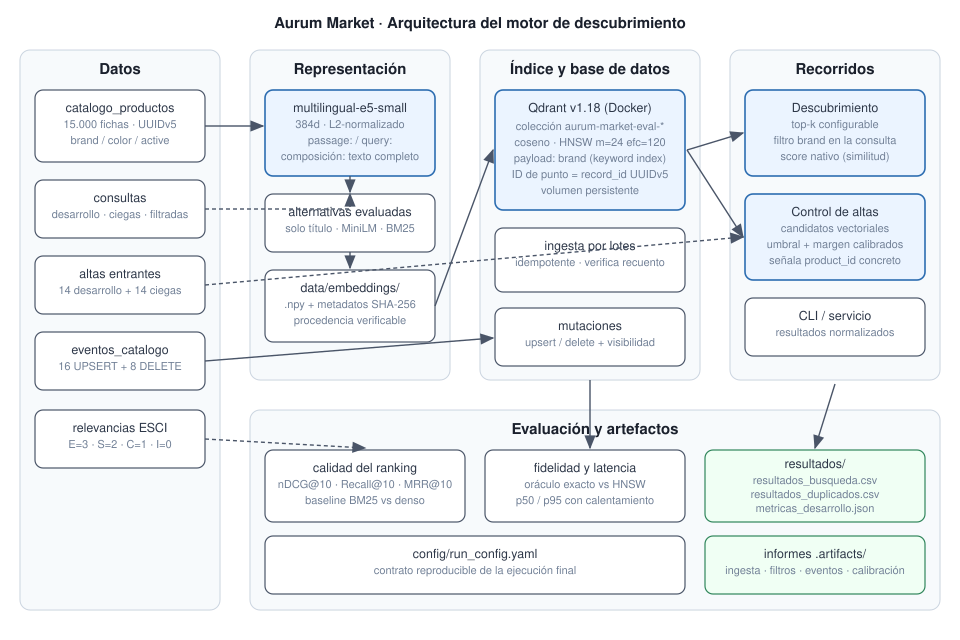

# Aurum Market: búsqueda semántica y control de catálogo

**Evaluación · Bases de Datos Vectoriales — Informe final**

El sistema entregado convierte los 15.000 productos de Aurum Market en un servicio de descubrimiento medible: recupera por intención, filtra por marca dentro de la propia consulta a la base de datos, absorbe altas, actualizaciones y bajas sin duplicar registros, y detecta altas potencialmente duplicadas con una regla calibrada solo con datos de desarrollo. El motor elegido es **Qdrant** (local, Docker) con su SDK nativo; la representación ganadora es **multilingual-e5-small** codificando **título + marca + color** en lugar del campo `text` completo, una decisión contraintuitiva que salió de los experimentos, no del catálogo de modelos.

## Índice de contenidos

1. [Contrato del sistema y baseline](#1-contrato-del-sistema-y-baseline)
2. [Representación vectorial](#2-representación-vectorial)
3. [Índice y base de datos](#3-índice-y-base-de-datos)
4. [Recuperación y filtros](#4-recuperación-y-filtros)
5. [Operaciones sobre el catálogo](#5-operaciones-sobre-el-catálogo)
6. [Control de altas duplicadas](#6-control-de-altas-duplicadas)
7. [Evaluación](#7-evaluación)
8. [Atribución de errores](#8-atribución-de-errores)
9. [Decisión recomendada y evolución](#9-decisión-recomendada-y-evolución)
10. [Anexo: reproducción y artefactos](#10-anexo-reproducción-y-artefactos)

---

## 1. Contrato del sistema y baseline

El sistema expone una interfaz única (`DiscoveryService` y la CLI `make search`) que recibe una consulta y devuelve resultados normalizados: `product_id`, posición, título, marca, `score` nativo y su semántica (`similarity`, mayor es mejor). Los dos recorridos de negocio comparten esa interfaz:

- **Descubrimiento**: top-*k* configurable, con filtro opcional de marca que viaja dentro de la consulta a la base de datos.
- **Control de altas**: la ficha entrante se codifica como documento, la base vectorial genera los candidatos y una regla de umbral decide si existe duplicado, señalando el `product_id` concreto.

Como referencia interpretable se implementó un **baseline léxico BM25** (k1=1.5, b=0.75, tokenización con minúsculas y sin tildes) sobre el mismo corpus. El baseline no es decorativo: fija el listón que la representación densa debe superar y, como se ve en §2, no lo supera en todas las métricas, lo que delimita honestamente dónde aporta la semántica.

**Arquitectura.** Datos → representación (embeddings con manifiesto SHA-256) → Qdrant (colección persistente con HNSW y payload indexado) → servicios de búsqueda y duplicados → evaluación y artefactos. El diagrama completo está en `docs/images/arquitectura.svg`.



## 2. Representación vectorial

**Texto codificado.** Cada producto se representa con una composición documentada y saneada: los valores vacíos son información ausente (nunca la cadena `"nan"`) y los campos vacíos se omiten. Se compararon dos composiciones y dos modelos, más el baseline léxico, siempre con búsqueda exacta para aislar la representación del índice:

| Experimento | Modelo | Texto | nDCG@10 | Recall@10 | MRR@10 |
|---|---|---|---|---|---|
| bm25_full_text | BM25 | campo `text` | 0.558 | 0.187 | 0.646 |
| e5_small_full | multilingual-e5-small | campo `text` | 0.533 | 0.205 | 0.588 |
| **e5_small_title** | **multilingual-e5-small** | **título + marca + color** | **0.555** | **0.223** | **0.698** |
| minilm_full | paraphrase-multilingual-MiniLM | campo `text` | 0.273 | 0.095 | 0.310 |

Dos conclusiones sostienen la elección de `e5_small_title`:

1. **El campo `text` completo perjudica a E5.** Las fichas del catálogo arrastran keyword-stuffing (títulos repetidos, listas de variantes, HTML residual). Codificar solo título+marca+color mejora las tres métricas frente al texto completo (+0.02 nDCG, +0.018 recall, +0.11 MRR). La suciedad no se corrigió a mano: se neutralizó eligiendo qué codificar, que es una decisión trazable del experimento.
2. **Cambiar de modelo sí se analizó, no solo se citó.** MiniLM, sin prefijos y entrenado para paráfrasis genérica, se hunde (nDCG 0.273): confirma que el prefijo `query:`/`passage:` y el entrenamiento de recuperación de E5 son la parte que importa, no la dimensión (ambos son 384d).

**Métrica, normalización y score.** Los embeddings se L2-normalizan al codificar y la colección usa distancia **coseno**; con vectores unitarios el score devuelto por Qdrant es la similitud coseno en [-1, 1] y "mayor es mejor". Esa semántica se conserva de extremo a extremo (`score_kind="similarity"` en el contrato de resultados) y nunca se compara con distancias.

Los embeddings se persisten en `data/embeddings/<configuración>/` con un manifiesto que fija modelo, prefijos, composición, dimensión y checksums SHA-256 de entradas y salidas, de modo que cualquier matriz puede auditarse contra el CSV del que salió.

## 3. Índice y base de datos

**Esquema.** Una colección Qdrant (`aurum-market-eval-catalogo`) con un vector sin nombre de 384d, distancia coseno, e ID de punto igual al `record_id` UUIDv5 del catálogo — el mismo UUID que el manifiesto de datos declara, verificado en carga. El payload conserva `product_id`, `title`, `brand`, `color`, `locale`, `catalog_version` y `active`; `brand` tiene índice de payload `keyword` creado junto con la colección para que el filtrado sea parte del plan de búsqueda. Los valores ausentes se guardan como cadena vacía, siempre con el mismo criterio.

**Configuración ANN explícita.** HNSW con `m=24`, `ef_construct=120` y `ef_search=128`, los mismos parámetros trabajados en la sesión de índices, fijados en `config/run_config.yaml`.

**Una lección de producción: el índice que no existía.** La primera versión funcional del sistema pasaba todas las pruebas y reportaba fidelidad ANN 1.0… porque no había índice. Qdrant solo construye el grafo HNSW cuando un segmento supera `indexing_threshold` (10–20 MB por defecto), y 15.000×384 float32 repartidos en 4 segmentos no lo alcanzan: `status=green` con `indexed_vectors_count=0`, y cada búsqueda "ANN" era en realidad un escaneo exhaustivo con `ef_search` inerte. Una revisión adversarial del código lo detectó verificándolo contra la colección viva. La corrección tiene dos partes: `optimizers_config.indexing_threshold=100` KB al crear la colección, y una verificación de arranque que no acepta consultas hasta que la colección está *green* **y** `indexed_vectors_count` cubre los puntos (esperar solo el estado verde no detecta nada, porque verde no implica indexado). Tras la corrección: 15.000/15.000 vectores indexados y las latencias bajan aproximadamente a la mitad (p50 de ~4.3 ms a ~2.1–2.4 ms). La moraleja queda en el sistema: la "verificación del estado de indexación" que exige el enunciado debe comprobar el índice, no el semáforo.

**Ingesta por lotes e idempotente.** Lotes de 256 con `wait=True` y upsert por `record_id`: repetir la ingesta completa deja exactamente 15.000 registros (verificado en el informe de ingesta: `count_before=15000, count_after=15000, idempotent=true`). La ingesta completa tarda ~4 s en local y la colección puede reconstruirse desde cero con `AURUM_ALLOW_RESET=true`.

## 4. Recuperación y filtros

La búsqueda global devuelve top-*k* con score nativo; la filtrada añade una condición `brand equals <valor>` **dentro** de `query_points` (filtrado del lado del servidor, sobre el índice de payload), nunca un post-filtrado del top-10 global. Las cuatro consultas filtradas devuelven 10/10 resultados que cumplen la marca (Einhell, Apple, NIKE, SAMSUNG), verificado automáticamente en `.artifacts/filtros/informe_filtros.json`.

Los casos límite tienen tratamiento explícito y probado: una colección vacía lanza un error accionable ("ingiere con `make ingest`"), un filtro sin resultados devuelve lista vacía sin error (sondeado con una marca inexistente: 0 resultados), y un Qdrant caído se traduce en `VectorStoreUnavailableError` con instrucciones, en todas las operaciones (búsqueda, ingesta, lecturas, borrados).

## 5. Operaciones sobre el catálogo

Los 24 eventos de `eventos_catalogo.csv` (8 actualizaciones, 8 altas, 8 bajas) se aplican en orden de `sequence` sobre una colección dedicada sembrada con el catálogo íntegro, de modo que los artefactos entregados —generados sobre el catálogo prístino— siguen siendo reproducibles. Ambas colecciones comparten esquema, configuración e ingesta.

- **Idempotencia**: la secuencia completa se aplica **dos veces**; el recuento final es 15.000 en ambas pasadas (8 altas − 8 bajas) y el estado es idéntico.
- **Visibilidad**: para una operación de cada tipo se verifica lectura por ID y consulta vectorial con espera activa acotada (`wait_until` con timeout). Con `wait=True` en las escrituras, la actualización muestra `catalog_version=2` y aparece en el top-3 de su propio vector en el primer intento (~3 ms); el alta es recuperable por ID y por búsqueda; la baja deja de ser legible y desaparece del top-10. El sistema no cronometra proveedores: demuestra que una escritura confirmada acaba siendo observable y que sabe esperar o fallar con deadline si no lo es.

**Seguridad de las operaciones.** Toda operación valida que la colección empiece por el prefijo `aurum-market-eval` antes de construir el cliente; recrear una colección exige `AURUM_ALLOW_RESET=true`; borrarla exige la confirmación exacta `AURUM_CONFIRM_CLEANUP=DELETE:<colección>`. Todo desactivado por defecto, sin credenciales en el repositorio y sin servicios cloud: el corrector no hereda costes.

## 6. Control de altas duplicadas

**Regla.** La base vectorial genera los 5 candidatos más próximos del alta entrante (codificada como documento, con la misma composición que el catálogo). Se declara duplicado si el mejor candidato alcanza `score ≥ 0.955`; el margen sobre el segundo candidato se registra como evidencia (umbral de margen 0.0: no resultó necesario, ver abajo).

**Calibración solo con desarrollo.** Sobre los 14 casos etiquetados, la rejilla explora todos los umbrales que separan scores observados. Los 7 duplicados puntúan en [0.980, 1.000] y los 7 no duplicados en [0.883, 0.931]: cualquier umbral en ese hueco logra F1=1.0. Se eligió un umbral **centrado en el margen de separación (0.955, con el punto medio exacto en 0.956)** en lugar del umbral máximo que devuelve la rejilla (0.9797), criterio *max-margin* que no se pega a ningún caso concreto y generaliza mejor. Con él: precision 1.0, recall 1.0, F1 1.0 en desarrollo, exigiendo además que el candidato señalado sea exactamente el producto de referencia etiquetado.

**Costes asimétricos.** Un falso positivo retiene una ficha legítima en revisión: molesta al vendedor y añade trabajo manual, pero es reversible en minutos. Un falso negativo publica un duplicado que fragmenta reseñas y stock y degrada el propio buscador; su coste es mayor y más silencioso. Por eso el desempate de la calibración prima la precisión (la cola de revisión debe ser creíble) pero el umbral elegido queda centrado, sin sacrificar recall. En desarrollo no hubo ni un tipo de error ni el otro; el caso más difícil (DEV-NEW-007, score 0.931, un no-duplicado muy parecido) queda a 0.024 del umbral y es el que habría que vigilar en producción.

**Evaluación ciega.** Sobre `altas_evaluacion.csv` la regla predice 7 duplicados y 7 altas nuevas; los positivos puntúan en [0.958, 1.000] con margen medio 0.08 y los negativos en [0.883, 0.897] — la misma separación limpia que en desarrollo, señal de que el umbral no está sobreajustado.

## 7. Evaluación

Todas las métricas se regeneran con un único comando (`make metrics`) y quedan en `resultados/metricas_desarrollo.json`; cada experimento conserva configuración, métricas e IDs recuperados.

**Declaración de relevancia (fijada antes de los experimentos y sin cambios):** nDCG@10 usa ganancias E=3, S=2, C=1, I=0; **Recall@10 considera relevantes E∪S** con el conjunto relevante completo como denominador (con hasta 39 relevantes por consulta, el techo alcanzable con k=10 es < 1.0 — se reporta sin maquillar el denominador); **MRR@10 considera relevante solo E**.

| Métrica | Valor | Lectura |
|---|---|---|
| nDCG@10 | 0.555 | El orden del top-10 captura algo más de la mitad de la ganancia ideal. |
| Recall@10 | 0.223 | Coherente con 10 resultados frente a conjuntos de hasta 39 relevantes. |
| MRR@10 | 0.698 | En 5 de 8 consultas el primer resultado ya es Exact. |
| Latencia p50 / p95 | 2.12 / 2.55 ms | 12 consultas × 30 repeticiones tras 5 de calentamiento, HNSW en local (WSL2, 8 vCPU); varía ±0.3 ms entre ejecuciones; describe esta ejecución, no compara proveedores. |
| Fidelidad ANN@10 | 1.000 (mín 1.000) | 20 consultas contra oráculo exacto en la misma colección (`SearchParams.exact=true`). |

**La fidelidad es una medición, no una tautología.** Tras el incidente de §3, la fidelidad se valida con un barrido de `ef_search` que demuestra que el índice puede perder y cuánto:

| ef_search | Fidelidad media@10 | Fidelidad mínima | p50 (ms) |
|---|---|---|---|
| 10 | 0.905 | 0.20 | 2.30 |
| 16 | 0.990 | 0.90 | 2.35 |
| 64 | 0.995 | 0.90 | 2.42 |
| **128** | **1.000** | **1.000** | 2.41 |

A 15.000 vectores el coste de `ef_search=128` es indistinguible del de 10 (~2.3–2.4 ms), así que se compra fidelidad perfecta gratis. La consulta que cae a 0.20 con ef=10 avisa de que el margen no es infinito: al crecer el catálogo este barrido es la herramienta de re-calibración.

## 8. Atribución de errores

Tres fallos representativos, con la capa responsable determinada por evidencia. La fidelidad ANN 1.000 en la configuración final descarta el índice en todos ellos: el vecino que devuelve HNSW es el vecino exacto.

**Caso 1 — Representación: "estantes sin taladro habitacion" (38249, MRR 0.25).** El top-3 es un libro de cocina *sin sal*, un disco y una novela (*Máscaras sin nombre*): E5 ancla la negación "sin + sustantivo" y con títulos cortos sin marca el parecido superficial domina. El oráculo exacto devuelve lo mismo: el vecino exacto ya es semánticamente malo, luego el error nace en la representación, no en el índice. Los estantes correctos (etiquetados E) entran en las posiciones 4–8. Mitigación razonable: componer el texto con una frase de categoría o un reranking léxico ligero del top-50.

**Caso 2 — Datos y juicios: "disfraz halloween talla grande hombre" (33633, nDCG 0.088).** El sistema devuelve 10 disfraces de Halloween reales, pero solo 4 productos del catálogo tienen juicio para esta consulta y el único Exact etiquetado es… una blusa de mujer (ruido del dataset ESCI). Los disfraces recuperados no están juzgados y computan ganancia 0. Hay también un fallo de representación genuino (ignora "talla grande hombre" y devuelve tallas y géneros variados), pero la magnitud del 0.088 la explican los juicios escasos y ruidosos: es un error de la capa de datos/etiquetas que ninguna configuración puede remontar.

**Caso 3 — Representación en atributos finos: "botines marrones mujer tacon medio" (18868, nDCG 0.329).** El puesto 2 es un botín *plateado de tacón bajo* etiquetado Irrelevant: el modelo acierta la categoría pero difumina color y altura de tacón, exactamente el tipo de atributo que la similitud coseno de un modelo pequeño comprime. Además, 3 de los 10 recuperados son botines marrones plausibles sin juicio. La mitigación estructural no es cambiar de modelo sino mover atributos duros (color) a metadatos filtrables, como ya se hace con la marca.

**Persistencia/consistencia:** ninguna discrepancia observada; las tres verificaciones de visibilidad de §5 convergen en el primer intento porque las escrituras usan `wait=True`.

## 9. Decisión recomendada y evolución

**Para Aurum Market hoy:** Qdrant local con HNSW (m=24, ef_construct=120, ef_search=128), `multilingual-e5-small` sobre título+marca+color, filtro de marca por payload indexado, regla de duplicados con umbral 0.955 sobre score coseno y revisión humana de los positivos. Todo el recorrido corre en un portátil, es idempotente y se reconstruye desde cero con dos comandos.

**Qué cambiaría al crecer el catálogo (15k → 1M):**

- *Índice*: el barrido de `ef_search` pasa de curiosidad a herramienta de operación; habría que re-medir fidelidad por percentil de consulta y presupuestar memoria del grafo (o evaluar cuantización escalar de Qdrant).
- *Representación*: el incidente del §8-caso 1 escala mal; un modelo mayor (e5-base) o un reranker sobre el top-100 se re-evaluarían con el mismo arnés de experimentos, que ya conserva IDs y configuraciones.
- *Duplicados*: con más altas diarias, el umbral único debería convertirse en dos (auto-rechazo / revisión humana / auto-aprobación) calibrados sobre la curva precision-recall completa.
- *Operativa*: la colección de eventos separada se sustituiría por *snapshots* de Qdrant y un flujo de reingesta azul/verde; los kill-switches de limpieza ya existen y se mantendrían.

El objetivo no era demostrar que una base vectorial devuelve algo: era saber cuándo sus resultados son útiles (consultas con intención clara y atributos blandos), qué capa explica sus errores (representación y juicios, no el índice) y qué decisión resiste producción (la configuración completa está en `config/run_config.yaml` y cada número de este informe se regenera desde ella).

---

## 10. Anexo: reproducción y artefactos

**Reproducción íntegra** (entorno limpio, ~10 min sin GPU):

```bash
make setup && make up && make embeddings && make pipeline
```

**Demo ejecutable:** `notebooks/actividad_aurum_market.ipynb` recorre cada
decisión con el sistema vivo (datos, experimento de representación, índice,
búsqueda con filtros, fidelidad, duplicados, mutaciones y artefactos); se
regenera con `make notebook`, se ejecuta headless con `make execute-notebook` y
se abre con `make lab`.

**Artefactos entregados:**

| Artefacto | Contenido |
|---|---|
| `resultados/resultados_busqueda.csv` | Top-10 por consulta ciega (12×10 filas, IDs únicos por consulta). |
| `resultados/resultados_duplicados.csv` | Decisión, candidato y score de las 14 altas ciegas. |
| `resultados/metricas_desarrollo.json` | nDCG/Recall/MRR@10, latencias p50/p95, fidelidad ANN, duplicados. |
| `config/run_config.yaml` | Configuración exacta de la ejecución final. |
| `docs/images/arquitectura.svg` | Diagrama de arquitectura. |
| `.artifacts/` | Informes de ingesta, filtros, eventos, calibración y barrido ef (regenerables). |

**Verificación previa a la entrega:** ingesta repetida sin aumentar recuento ✔ · filtros nunca devuelven otra marca ✔ · eventos dejan el estado esperado dos veces ✔ · 12 rankings ciegos con 10 IDs únicos y válidos ✔ · toda predicción positiva señala candidato ✔ · métricas regenerables con `make metrics` ✔ · sin claves ni datos reservados en el repositorio ✔ (55 pruebas automatizadas: `make test`, `make test-integration`).

**Referencias:** ver `docs/REFERENCIAS.md`.
