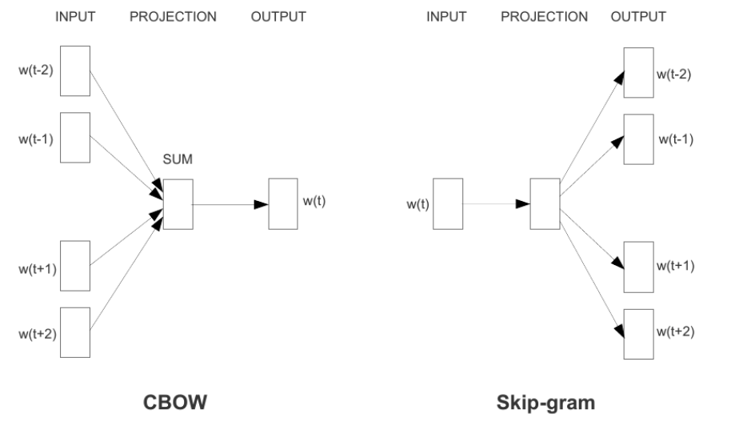
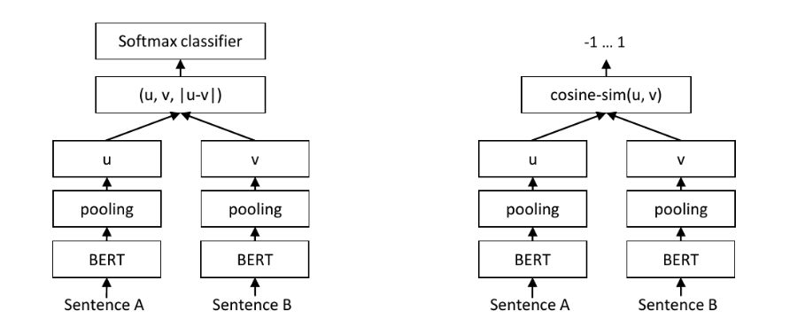
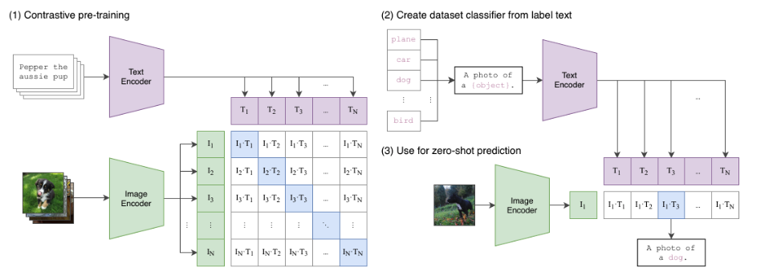

# BBDD Vectoriales

## Índice de Contenidos

0. [Introducción](#0-introducción)
1. [Contextualización](#1-contextualización)
   - [1.1. El problema de negocio](#11-el-problema-de-negocio)
   - [1.2. El conjunto de datos y los juicios de relevancia](#12-el-conjunto-de-datos-y-los-juicios-de-relevancia)
2. [Representar información mediante vectores](#2-representar-información-mediante-vectores)
   - [2.1. Vectores dispersos y vectores densos](#21-vectores-dispersos-y-vectores-densos)
   - [2.2. Dimensionalidad y coste](#22-dimensionalidad-y-coste)
3. [La geometría que hay detrás de una búsqueda](#3-la-geometría-que-hay-detrás-de-una-búsqueda)
   - [3.1. Producto escalar](#31-producto-escalar)
   - [3.2. Similitud coseno](#32-similitud-coseno)
   - [3.3. Distancia euclídea](#33-distancia-euclídea)
   - [3.4. La trampa de comparar scores entre modelos](#34-la-trampa-de-comparar-scores-entre-modelos)
4. [Representaciones dispersas](#4-representaciones-dispersas)
   - [4.1. Bag-of-Words](#41-bag-of-words)
   - [4.2. Term Frequency–Inverse Document Frequency (TF-IDF)](#42-term-frequencyinverse-document-frequency-tf-idf)
5. [Primeras representaciones densas](#5-primeras-representaciones-densas)
   - [5.1. Word2Vec](#51-word2vec)
   - [5.2. GloVe](#52-glove)
   - [5.3. FastText](#53-fasttext)
6. [Representaciones contextuales](#6-representaciones-contextuales)
   - [6.1. BERT](#61-bert)
   - [6.2. Sentence-BERT](#62-sentence-bert)
7. [Modelos modernos de embeddings](#7-modelos-modernos-de-embeddings)
   - [7.1. Multilingual E5](#71-multilingual-e5)
   - [7.2. Modelos accesibles mediante API](#72-modelos-accesibles-mediante-api)
   - [7.3. Matryoshka Representation Learning](#73-matryoshka-representation-learning)
   - [7.4. Modelos con pesos accesibles](#74-modelos-con-pesos-accesibles)
8. [Más allá de un único vector denso](#8-más-allá-de-un-único-vector-denso)
   - [8.1. Sparse aprendido y SPLADE](#81-sparse-aprendido-y-splade)
   - [8.2. Recuperación híbrida](#82-recuperación-híbrida)
   - [8.3. Late interaction y ColBERT](#83-late-interaction-y-colbert)
   - [8.4. Embeddings multimodales](#84-embeddings-multimodales)
9. [Evaluar un buscador semántico](#9-evaluar-un-buscador-semántico)
   - [9.1. Recall@k](#91-recallk)
   - [9.2. DCG y nDCG](#92-dcg-y-ndcg)
   - [9.3. Latencia, memoria y coste](#93-latencia-memoria-y-coste)
   - [9.4. Benchmarks como punto de partida para elegir modelos: MTEB y MMTEB](#94-benchmarks-como-punto-de-partida-para-elegir-modelos-mteb-y-mmteb)
10. [Referencias y bibliografía](#10-referencias-y-bibliografía)

---

## 0. Introducción

Las sesiones prácticas de la asignatura de **BBDD Vectoriales** discurrirán tratando de componer una solución completa a un caso de uso práctico que trata de evidenciar un caso de negocio real: **¿cómo hacemos que un buscador de productos entienda la intención del usuario sin perder las coincidencias exactas que importan?**

Asumiremos que un supuesto negocio de e-commerce quiere potenciar su buscador, ya que ha detectado que un cierto perfil de usuario es propenso a realizar búsquedas describiendo la intención en lugar de dar una definición exacta del producto. Así, búsquedas como _"necesito una silla para mi despacho que sea más cómoda porque la que tengo me está destrozando la espalda"_ derivaría al usuario a encontrar coincidencias de productos relacionados con sillas ergonómicas.

Esto lo lograremos gracias a la combinación del uso de **modelos de embeddings**, modelos capaces de representar cualquier tipo de información no estructurada en forma de vectores conservando su significado; y algoritmos de **búsqueda semántica**, cuyo objetivo será proporcionar un número $k$ de resultados relevantes a una solicitud o _query_ (de aquí en adelante, preferiremos usar el término _query_) comparando su similitud en significado.

---

## 1. Contextualización

### 1.1. El problema de negocio

Antes de hablar de modelos, vectores o medidas de similitud, conviene precisar qué problema estamos tratando de resolver. Un buscador de productos recibe bajo la misma caja de texto comportamientos que, en realidad, son bastante diferentes. Hay usuarios que conocen exactamente el producto que necesitan y escriben consultas como _"taladro 24V batería"_, _"funda iPad Air 4 sin tapa"_ o _"televisión 28 pulgadas"_. En estos casos, las palabras concretas, los números, las unidades y las referencias de modelo son una señal extraordinariamente valiosa. Sería bastante absurdo construir una solución supuestamente inteligente que, por querer entender el significado general, dejase de distinguir un taladro de 24V de uno de 18V.

Sin embargo, otro usuario puede necesitar exactamente el mismo producto sin conocer el vocabulario con el que aparece descrito en el catálogo. Puede escribir _"quiero una herramienta inalámbrica potente para perforar sin depender de un enchufe"_, _"necesito proteger por detrás mi iPad dejando la pantalla descubierta"_ o _"busco un televisor pequeño de unos setenta centímetros para la cocina"_. La intención sigue siendo reconocible para una persona, pero la coincidencia literal entre la query y el texto del producto se ha reducido considerablemente.

A esta separación entre las palabras empleadas por el usuario y las palabras utilizadas por el documento se la suele denominar **vocabulary gap**. No aparece porque la query esté mal escrita ni porque el catálogo esté necesariamente mal construido. Aparece porque el lenguaje admite sinónimos, perífrasis, consecuencias, abreviaturas, cambios de unidad y descripciones funcionales. El usuario dice _"sin hacer agujeros"_ donde la ficha dice _"sin taladro"_; dice _"apoyo para la espalda"_ donde el vendedor escribió _"ergonómica"_; o expresa en centímetros una medida almacenada en pulgadas.

La búsqueda semántica pretende cerrar esa distancia. Ahora bien, no debemos confundir este objetivo con sustituir indiscriminadamente la búsqueda léxica. El problema de negocio real consiste en conservar la precisión de las coincidencias exactas y, al mismo tiempo, ampliar la capacidad del sistema para reconocer una necesidad expresada de otra manera. Esto nos llevará, como veremos, a comparar representaciones dispersas y densas, a estudiar sus errores y a plantear la posibilidad de combinar ambas.

### 1.2. El conjunto de datos y los juicios de relevancia

Para trabajar con algo más serio que una colección de frases inventadas, emplearemos una muestra española del **Shopping Queries Dataset** publicado por Amazon Science [[1]](#ref-1). El dataset aporta consultas, productos y juicios de relevancia ESCI. Una pareja query-producto puede considerarse `Exact` cuando satisface de manera precisa la necesidad; `Substitute` cuando ofrece una alternativa razonable pero imperfecta; `Complement` cuando acompaña al producto buscado sin sustituirlo; o `Irrelevant` cuando no resuelve la necesidad.

Esta relevancia graduada resulta mucho más cercana a un problema comercial que una etiqueta binaria. Para la query _"funda iPad Air 4 sin tapa"_, una funda compatible que incorpora tapa podría ser un sustituto; un protector de pantalla, un complemento; y un cargador de portátil, un resultado irrelevante. El orden entre estas posibilidades importa: no basta con que el producto aparezca en algún lugar de la lista.

El modelo de embeddings es solamente una parte del buscador. Entre el texto original y el resultado visible intervienen la composición de la ficha, la generación de la representación, el índice, la función de similitud y las reglas de negocio. Un fallo en cualquiera de estas decisiones puede deteriorar el ranking aunque el encoder sea excelente.

---

## 2. Representar información mediante vectores

Un vector no es más que una secuencia ordenada de números. Si escribimos $\mathbf{x}=[x_1,x_2,\ldots,x_d]$, diremos que $\mathbf{x}$ pertenece a un espacio de $d$ dimensiones. La cuestión interesante no está en el contenedor matemático, sino en qué significa cada valor y en cómo se ha construido.

Una función de representación transforma una entrada $x$ en un vector:

$$
f(x)=\mathbf{x}\in\mathbb{R}^{d}
$$

En un modelo de conteo, una coordenada puede corresponder de manera directa a una palabra concreta del vocabulario. En un embedding neuronal, la información acostumbra a estar distribuida: no existe necesariamente una dimensión que signifique _"ergonomía"_ y otra que signifique _"producto para oficina"_. El significado emerge del patrón completo y, sobre todo, de las relaciones geométricas entre representaciones.

Este matiz es importante porque evita interpretar un embedding como una ficha de atributos perfectamente legible. El modelo no está construyendo una tabla con columnas humanas; está aprendiendo una geometría que debe resultar útil para alguna tarea. Dos textos pueden acabar cerca porque el entrenamiento ha enseñado al modelo que funcionan como pares relacionados, no porque compartan una coordenada aislada fácil de nombrar.

En nuestro caso, tampoco existe un único campo que represente por sí solo al producto. El catálogo contiene título, marca, color, _bullet points_ y descripción. La secuencia que entregamos al modelo se compone concatenando estos campos en un orden determinado y añadiendo etiquetas como `Marca:` o `Color:`. Esta operación forma parte de la representación. Si mañana cambiamos la plantilla, el orden, el truncado o el tratamiento de valores nulos, hemos cambiado la entrada del modelo y deberemos regenerar los vectores.

De poco sirve guardar el identificador del modelo si no conservamos también este contrato. Un índice reproducible necesita conocer la versión del encoder, su dimensión, la estrategia de normalización, los prefijos o instrucciones aplicadas y la plantilla exacta que compuso cada documento. Dos matrices con 384 columnas pueden tener la misma forma y, sin embargo, pertenecer a espacios semánticos incompatibles.

### 2.1. Vectores dispersos y vectores densos

Un vector **disperso** o _sparse_ contiene una gran cantidad de ceros. Supongamos que el vocabulario del marketplace tiene 50.000 términos y que la ficha de un producto activa 40. El vector posee 50.000 dimensiones, aunque solo almacene información en una fracción minúscula de ellas. Esta estructura se presta a formatos comprimidos e índices invertidos que evitan almacenar o recorrer los ceros.

Un vector **denso** suele tener una dimensionalidad mucho menor y casi todas sus coordenadas contienen valores distintos de cero. Los embeddings que utilizaremos pueden tener 384, 512, 768, 1.024, 1.536 o 3.072 dimensiones, dependiendo del modelo y de su configuración. La información no queda ligada a palabras explícitas del vocabulario, sino distribuida a lo largo del vector.

No debemos confundir _sparse_ con pequeño ni _dense_ con grande. Un vector sparse puede tener millones de dimensiones; un vector dense puede tener 384. La diferencia describe el patrón de valores y condiciona memoria, operaciones e índices disponibles.

### 2.2. Dimensionalidad y coste

La dimensión $d$ influye de forma directa en almacenamiento y cálculo. Un millón de vectores `float32` de 384 dimensiones requiere aproximadamente 1,43 GiB antes de contar la estructura del índice. A 3.072 dimensiones, el almacenamiento bruto asciende a unos 11,44 GiB. Comparar una query con un documento también exige un trabajo que, en una operación directa, crece linealmente con $d$.

Esto no implica que debamos escoger siempre el vector más corto. Una representación demasiado comprimida puede perder matices relevantes. Tampoco implica que más dimensiones garanticen mejor calidad. La capacidad adicional solo aporta valor si la mejora se manifiesta en nuestro problema en tal grado que compensa el aumento de dimensiones.

En puntos aleatorios de alta dimensión aparece, además, la llamada **concentración de distancias** o la **maldición de la dimensionalidad**. En términos relativos, el vecino más cercano y el más lejano tienden a parecerse cada vez más. Los embeddings aprendidos no son nubes gaussianas aleatorias, por lo que no podemos concluir que una dimensión alta sea necesariamente mala. La observación sí nos sirve para desmontar una idea simplista: el número de coordenadas, por sí solo, no mide la calidad del modelo.

---

## 3. La geometría que hay detrás de una búsqueda

Generar embeddings no genera automáticamente un ranking. Todavía necesitamos una función que compare la query con cada candidato. La representación y la métrica forman juntas el sistema de recuperación: un mismo conjunto de vectores puede producir rankings diferentes si modificamos la manera de medir proximidad.

### 3.1. Producto escalar

El producto escalar entre $\mathbf{q}$ y $\mathbf{x}$ multiplica coordenadas correspondientes y las suma:

$$
\mathbf{q}^{\top}\mathbf{x}=\sum_{i=1}^{d}q_i x_i
$$

También puede expresarse como

$$
\mathbf{q}^{\top}\mathbf{x}=
\lVert\mathbf{q}\rVert_2\lVert\mathbf{x}\rVert_2\cos(\theta)
$$

Esta segunda forma deja claro que el score combina alineación y magnitud. Dos vectores que apuntan en direcciones parecidas obtendrán un valor elevado, pero también se verán favorecidos los vectores de norma grande. Esto puede ser deseable si el entrenamiento utiliza la norma para codificar popularidad, confianza u otra señal; pero puede ser desastroso si la magnitud varía por longitud del documento o por una particularidad accidental.

### 3.2. Similitud coseno

La similitud coseno divide el producto escalar por ambas normas:

$$
\cos(\mathbf{q},\mathbf{x})=
\frac{\mathbf{q}^{\top}\mathbf{x}}
{\lVert\mathbf{q}\rVert_2\lVert\mathbf{x}\rVert_2}
$$

El resultado conserva la dirección y elimina la escala. Dos vectores paralelos obtienen coseno 1 aunque uno mida diez veces más que otro. Esta propiedad suele encajar bien con embeddings de texto cuando nos interesa el patrón semántico y no existe un significado claro para la magnitud.

Ojo: normalizar no es un trámite cosmético. Al dividir por la norma estamos decidiendo que la magnitud no participará en el ranking. Si el modelo la utilizaba, hemos eliminado información. La documentación y el protocolo de entrenamiento deben indicar qué métrica corresponde a cada encoder.

### 3.3. Distancia euclídea

La distancia euclídea o distancia L2 mide el desplazamiento directo entre dos puntos:

$$
d_{L2}(\mathbf{q},\mathbf{x})=
\sqrt{\sum_{i=1}^{d}(q_i-x_i)^2}
$$

Nótese que en una medida de similitud, como la similitud coseno o el producto escalar, un valor mayor suele ser mejor; mientras que en una distancia, un valor menor es mejor. Es posible convertir la distancia en un score e interpretarlo como "similitud" mediante su negativo para ordenar siempre de forma descendente, ya que el cambio de signo no altera la geometría.

Si query y documentos están normalizados con L2, coseno y producto escalar coinciden. Además:

$$
\lVert\widehat{\mathbf{q}}-\widehat{\mathbf{x}}\rVert_2^2
=2-2\widehat{\mathbf{q}}^{\top}\widehat{\mathbf{x}}
$$

Por tanto, coseno, producto escalar y distancia euclídea generan el mismo orden sobre vectores unitarios, aunque sus scores tengan otra escala y la distancia euclídea se ordene en sentido contrario. Esta equivalencia tiene una utilidad práctica: el coseno puede calcularse mediante una multiplicación matricial muy eficiente una vez normalizados los embeddings.

### 3.4. La trampa de comparar scores entre modelos

Un coseno de 0,88 no significa un 88 % de relevancia ni un 88 % de confianza. Es una medida interna del espacio y de la configuración utilizada. Sirve para ordenar candidatos generados por el mismo sistema. No sirve para afirmar que un modelo con cosenos de 0,90 es mejor que otro cuyos scores rondan 0,70.

Cada encoder aprende una distribución diferente. Para comparar modelos debemos comparar rankings mediante juicios de relevancia, no enfrentar sus scores crudos. Un modelo puede comprimir casi todos sus cosenos en un intervalo estrecho y ordenar perfectamente; otro puede presentar scores espectaculares y situar productos irrelevantes en la cabeza del ranking.

A la hora de evaluar qué modelo de embedding funciona mejor, deberemos testearlos con respecto a las métricas de negocio que realmente importan en nuestro caso de uso.

---

## 4. Representaciones dispersas

### 4.1. Bag-of-Words

Bag-of-Words es un algoritmo que construye los vectores en base a las apariciones de términos en un texto que se desea representar [[2]](#ref-2). Este define un vocabulario conformado por todos los términos del corpus y asigna una dimensión a cada uno. Por ejemplo, si todo el texto que tuviéramos estuviese conformado por las siguientes cuatro frases:

- _"Me he comprado una nueva silla"_.
- _"Quiero una silla ergonómica"_.
- _"Mi nueva silla ergonómica es la mejor silla del mundo"_.
- _"Mi silla ergonómica es horrorosa"_.

El vocabulario estaría conformado por los siguientes términos:

```python
{
    "me", "he", "comprado", "una", "nueva", "silla", "quiero",
    "ergonómica", "mi", "es", "la", "mejor", "del", "mundo", "horrosa"
}
```

Y, consecuentemente, nuestras frases quedarían representadas por los siguientes vectores:

- $[1, 1, 1, 1, 1, 1, 0, 0, 0, 0, 0, 0, 0, 0, 0]$
- $[0, 0, 0, 1, 0, 1, 1, 1, 0, 0, 0, 0, 0, 0, 0]$
- $[0, 0, 0, 0, 1, 2, 0, 1, 1, 1, 1, 1, 1, 1, 0]$
- $[0, 0, 0, 0, 0, 1, 0, 1, 1, 1, 0, 0, 0, 0, 1]$

Así, nuestros vectores siempre tendran una dimensión $d$ que coincide con el número total de términos que componen el vocabulario de nuestro corpus. Si tenemos 50.000 términos únicos, tendremos consecuentemente vectores de dimensión $d=50.000$. Si bien, la mayoría de estas dimensiones estarán compuestas por $0$, de ahí que estemos ante una representación dispersa de la información. No obstante, formatos como CSR almacenan valores no nulos, posiciones y punteros de fila, evitando reservar memoria para miles de ceros por producto.

Ahora bien, este método es sencillo, explicable y sorprendentemente útil. Si una persona escribe una referencia de producto, una marca o una medida rara, la coincidencia exacta puede ser la mejor señal disponible. No existe ninguna razón seria para despreciar esta capacidad por el mero hecho de que el algoritmo no utilice una red neuronal o algún modelo súper sofisticado.

La contrapartida es que se pierde el orden. Búsquedas como _"Funda iPad sin tapa de cámara"_ y _"tapa de cámara iPad sin funda"_ activan exactamente las mismas coordenadas y se representan con exactamente los mismos vectores. Asimismo, Bag-of-Words tampoco sabe que _"televisor"_ y _"televisión"_ pueden referirse a la misma categoría, salvo que apliquemos normalización lingüística o características adicionales. Y además, no es un algoritmo capaz de manejar la polisemia: la representación de la palabra _"lima"_ va a ser exactamente la misma, independientemente de que estuviéramos buscando como producto la herramienta para limarnos las uñas o la fruta.

### 4.2. Term Frequency–Inverse Document Frequency (TF-IDF)

En una representación Bag-of-Words basada únicamente en conteos, todas las palabras se contabilizan siguiendo la misma lógica: cuantas más veces aparece un término en un documento, mayor es el valor de su coordenada. El problema es que una frecuencia elevada no implica necesariamente que el término sea útil para distinguir ese documento del resto.

Imaginemos que una ficha de producto contiene varias veces palabras como _"producto"_, _"calidad"_ o _"para"_. Sus conteos serán elevados, pero estas palabras aparecen también en miles de productos del catálogo. Por tanto, apenas aportan información para decidir si una ficha es especialmente relevante para una query.

En cambio, términos como _"iPad Air 4"_, _"24V"_ o _"28 pulgadas"_ probablemente aparezcan en un conjunto mucho más reducido de productos. Aunque solo se mencionen una vez, pueden resultar mucho más útiles para identificar qué ficha debe ocupar las primeras posiciones del ranking.

TF-IDF intenta corregir este problema combinando dos factores dentro de un único peso [[2]](#ref-2):

$$
\operatorname{TF\text{-}IDF}(t,d)
=
\operatorname{TF}(t,d)\cdot \operatorname{IDF}(t)
$$

> ¡Ojo! No estamos hablando de dos algoritmos independientes. TF e IDF son los dos componentes que forman el peso TF-IDF de un término.

**Term Frequency (TF)**

El primer componente es **Term Frequency**, abreviado como TF. Este valor mide la frecuencia del término $t$ dentro del documento $d$.

En su versión más sencilla, TF puede ser simplemente el número de veces que aparece el término:

$$
\operatorname{TF}(t,d)
=
\text{número de apariciones de }t\text{ en }d
$$

Si _"ergonómica"_ aparece tres veces en la ficha de una silla y _"reposabrazos"_ aparece una vez, el primer término tendrá una frecuencia mayor. La intuición es que un término repetido puede caracterizar mejor el contenido del documento.

Sin embargo, utilizar directamente el conteo puede otorgar demasiado peso a las repeticiones. Que una palabra aparezca veinte veces no significa necesariamente que sea veinte veces más importante que otra que aparece una sola vez. Por ello, es habitual aplicar una transformación sublineal:

$$
\operatorname{TF}(t,d)=
\begin{cases}
1+\log\bigl(\operatorname{count}(t,d)\bigr),
& \text{si }\operatorname{count}(t,d)>0 \\[4pt]
0,
& \text{en otro caso}
\end{cases}
$$

Esta transformación mantiene la idea de que una mayor frecuencia aporta más peso, pero reduce el efecto de las repeticiones excesivas.

**Inverse Document Frequency (IDF)**

El segundo componente es **Inverse Document Frequency**, abreviado como IDF. Este valor mide lo poco frecuente que resulta un término en el conjunto completo de documentos.

Para calcularlo necesitamos conocer la **Document Frequency**, o DF:

$$
\operatorname{DF}(t)
=
\text{número de documentos del catálogo que contienen }t
$$

Ojo con esta definición: DF no cuenta cuántas veces aparece el término en total. Cuenta en cuántos documentos distintos aparece al menos una vez.

Si _"producto"_ aparece en 45.000 de las 50.000 fichas del catálogo, su DF será muy elevada. Si _"iPad Air 4"_ aparece únicamente en 70 fichas, su DF será mucho menor.

A partir de este valor calculamos IDF. Una versión suavizada puede expresarse como:

$$
\operatorname{IDF}(t)
=
\log\left(
\frac{N+1}{\operatorname{DF}(t)+1}
\right)+1
$$

donde $N$ representa el número total de documentos del catálogo.

Así, el cociente será pequeño para los términos que aparecen en muchos documentos y será mayor para aquellos que aparecen en pocos. En consecuencia, un término muy común recibe un IDF bajo, mientras que un término poco frecuente recibe un IDF alto.

**La representación vectorial resultante**

Finalmente, el peso TF-IDF surge al multiplicar ambos componentes:

$$
\operatorname{TF\text{-}IDF}(t,d)
=
\operatorname{TF}(t,d)\cdot \operatorname{IDF}(t)
$$

El resultado será elevado cuando se cumplan simultáneamente dos condiciones: que el término tenga presencia en el documento y que, además, no aparezca indiscriminadamente en todo el catálogo.

Esta combinación permite diferenciar situaciones que el conteo bruto trataría de manera demasiado parecida. Supongamos que una ficha contiene una vez _"producto"_ y una vez _"iPad Air 4"_. Ambos términos tendrían el mismo TF, pero no el mismo IDF. Como _"iPad Air 4"_ aparece en muchas menos fichas, su peso TF-IDF será considerablemente mayor.

Una vez calculados los pesos, cada documento se representa mediante un vector cuyas coordenadas corresponden a las características del vocabulario. Así, si el vocabulario fuese:

$$
[
\text{producto},
\text{silla},
\text{ergonómica},
\ \dots\ ,
\text{24V},
\text{iPad Air 4}
]
$$

la ficha de una silla podría quedar representada como:

$$
[0.03,\ 0.41,\ 0.78,\ \dots \ , \ 0,\ 0]
$$

Así, los valores no son conteos, sino pesos TF-IDF. _"Producto"_ recibe poco peso porque aparece en gran parte del catálogo. _"Ergonómica"_ recibe más porque tiene presencia en esa ficha y es más discriminativa dentro de la colección. Los términos ausentes mantienen un valor igual a cero.

Seguimos teniendo, por tanto, una representación dispersa: el vocabulario puede contener miles de características, pero cada producto solo activa una pequeña parte de ellas. Consecuentemente, TF-IDF es especialmente potente cuando la query y el producto comparten términos discriminativos. Marcas, referencias, medidas, nombres de modelos y especificaciones técnicas son precisamente el tipo de información que esta representación puede destacar muy bien.

Una query como _"taladro 24V batería"_ contiene características muy concretas. Si la ficha relevante incluye _"taladro"_, _"24V"_ y _"batería"_, los pesos TF-IDF producirán una coincidencia fuerte y fácilmente explicable.

La dificultad aparece cuando la intención se expresa mediante otro vocabulario: _"quiero una herramienta inalámbrica potente para perforar sin depender de un enchufe"_.

La necesidad puede ser equivalente, pero el solapamiento literal con _"taladro 24V batería"_ es mucho menor. TF-IDF no sabe por sí mismo que _"perforar"_ está relacionado con _"taladro"_, que _"inalámbrica"_ sugiere el uso de una batería o que _"sin depender de un enchufe"_ describe la misma restricción.

Por tanto, TF-IDF no debe entenderse como una versión rudimentaria que haya que eliminar en cuanto aparecen los embeddings densos. Es un baseline sólido, eficiente y especialmente valioso para coincidencias exactas. Su limitación principal es que define la similitud a partir del vocabulario compartido, no a partir del significado aprendido.

Esta distinción será la que justifique el siguiente paso: incorporar representaciones densas capaces de acercar expresiones semánticamente relacionadas aunque no utilicen las mismas palabras.

---

## 5. Primeras representaciones densas

Los métodos de conteo que acabamos de estudiar representan cada texto a partir de las palabras que aparecen en él. Esta estrategia funciona muy bien cuando la query y el producto comparten vocabulario, pero no permite deducir por sí sola que términos diferentes pueden estar relacionados. Para TF-IDF, _"silla"_ y _"asiento"_ ocupan dos coordenadas independientes, aunque dentro del catálogo aparezcan constantemente en contextos parecidos.

Los primeros modelos de embeddings aprendidos introducen una idea diferente: en lugar de definir manualmente qué significa cada coordenada, aprenden la representación observando el contexto de las palabras. Esta idea se apoya en la **hipótesis distribucional**, según la cual dos palabras que aparecen habitualmente rodeadas de términos similares tienden a mantener alguna relación semántica o funcional.

Por ejemplo, _"silla"_ y _"asiento"_ pueden aparecer cerca de palabras como _"cómodo"_, _"respaldo"_, _"oficina"_ o _"ergonómico"_. Aunque no sean la misma palabra, el contexto proporciona una señal que permite acercar sus representaciones. Lo importante es que nadie necesita indicarle explícitamente al modelo que ambas están relacionadas: esa relación se aprende a partir del corpus.

### 5.1. Word2Vec

Word2Vec aprende un vector denso para cada palabra del vocabulario mediante una tarea de predicción [[3]](#ref-3). Su objetivo inmediato no consiste en identificar sinónimos ni en calcular directamente la similitud entre productos. Se le plantea una tarea auxiliar: predecir palabras a partir del contexto. Para resolverla, el modelo acaba construyendo representaciones que capturan regularidades útiles del lenguaje.

Los ejemplos de entrenamiento se generan recorriendo el corpus mediante una ventana deslizante. Supongamos la siguiente descripción de producto:

> _"silla ergonómica con respaldo lumbar ajustable"_

Si tomamos _"respaldo"_ como palabra central y observamos dos posiciones a cada lado, algunas de sus palabras de contexto serían _"ergonómica"_, _"con"_, _"lumbar"_ y _"ajustable"_. Al repetir este procedimiento sobre todo el corpus obtenemos multitud de relaciones entre palabras centrales y palabras de contexto.

Word2Vec propone dos maneras de aprender a partir de esas relaciones. En **Continuous Bag-of-Words**, o CBOW, el modelo recibe las palabras del contexto e intenta predecir la palabra central. En el ejemplo anterior, podría recibir _"ergonómica"_, _"con"_, _"lumbar"_ y _"ajustable"_ e intentar predecir _"respaldo"_.

En **Skip-gram** se realiza el proceso contrario: el modelo recibe la palabra central e intenta predecir las palabras que aparecen a su alrededor. A partir de _"respaldo"_ se generarían pares positivos como $(\text{respaldo},\text{lumbar})$ o $(\text{respaldo},\text{ajustable})$.



*Figura 1. CBOW combina las palabras del contexto para predecir la palabra central; Skip-gram parte de la palabra central para predecir las palabras del contexto. Fuente: Mikolov et al. [[3]](#ref-3), figura 1.*

CBOW acostumbra a ser más rápido porque combina el contexto para realizar una predicción. Skip-gram genera varios pares por palabra central y suele aprender mejor representaciones de palabras poco frecuentes, aunque requiere más trabajo. No estamos, por tanto, ante dos modelos completamente ajenos, sino ante dos objetivos de entrenamiento para aprender el mismo tipo de representación: un vector por palabra.

**Negative sampling**

Para calcular la probabilidad completa de una palabra de contexto sería necesario comparar la palabra central con todo el vocabulario. Si este contiene cientos de miles de términos, repetir esa operación para cada pareja resulta muy costoso.

**Negative sampling** simplifica el problema. En lugar de preguntar _"cuál de todas las palabras del vocabulario es el contexto correcto?"_, el modelo aprende a distinguir parejas reales de unas pocas parejas falsas.

Para el par positivo $(\text{respaldo},\text{lumbar})$ queremos aumentar la compatibilidad entre ambos vectores:

$$
\log \sigma(\mathbf{v}_{\text{lumbar}}^{\top}\mathbf{v}_{\text{respaldo}})
$$

Después generamos palabras negativas que no aparecían en ese contexto, por ejemplo $(\text{respaldo},\text{microondas})$, y tratamos de reducir su compatibilidad:

$$
\log \sigma(-\mathbf{v}_{\text{microondas}}^{\top}\mathbf{v}_{\text{respaldo}})
$$

La función sigmoide $\sigma$ transforma el producto escalar en un valor entre cero y uno. Durante el entrenamiento, las parejas observadas en el corpus reciben actualizaciones que aumentan su proximidad, mientras que las parejas negativas se separan. Si dos palabras aparecen en contextos semejantes, sus vectores reciben actualizaciones parecidas y acaban ocupando regiones próximas del espacio.

**Qué obtenemos de Word2Vec**

Una vez entrenado, Word2Vec proporciona una matriz con un vector denso por palabra del vocabulario. Sobre ella podemos consultar qué palabras están más cerca de _"silla"_, _"taladro"_ o _"portátil"_ y comprobar qué regularidades ha aprendido el corpus.

La calidad de esas relaciones depende completamente de los datos. Si entrenamos Word2Vec únicamente con 336 productos, el modelo habrá observado muy pocos contextos y sus vecinos serán inestables. Un resultado mediocre en una muestra tan pequeña no demuestra que Word2Vec sea un mal algoritmo; demuestra que los embeddings distribucionales necesitan suficiente evidencia.

Word2Vec mantiene, además, dos limitaciones importantes. La primera es que cada palabra posee un vector fijo. _"Banco"_ recibe la misma representación en _"trabajo en un banco"_ y en _"siéntate en el banco"_, aunque el significado cambie por completo.

La segunda es que el modelo representa palabras, no fichas de producto ni queries completas. Para construir el vector de una frase podríamos promediar los embeddings de sus palabras, pero este procedimiento pierde el orden, la negación y la estructura. _"Funda iPad con tapa"_ y _"funda iPad sin tapa"_ compartirían prácticamente los mismos vectores de palabra y su promedio sería muy parecido.

### 5.2. GloVe

Word2Vec aprende recorriendo ejemplos locales creados mediante ventanas deslizantes. GloVe, cuyo nombre procede de **Global Vectors**, parte de la misma hipótesis distribucional, pero utiliza directamente estadísticas globales de coaparición [[4]](#ref-4).

Para ello construye una matriz $X$ en la que cada elemento $X_{ij}$ indica cuántas veces aparece la palabra $j$ dentro del contexto de la palabra $i$. Si _"lumbar"_ aparece con frecuencia alrededor de _"respaldo"_, el valor correspondiente será elevado. Si _"microondas"_ casi nunca aparece en ese contexto, su valor será muy bajo o cero.

La información interesante no reside únicamente en los conteos aislados, sino también en sus relaciones. _"Silla"_ y _"asiento"_ pueden presentar patrones de coaparición similares con _"respaldo"_, _"cómodo"_ u _"oficina"_. GloVe trata de comprimir esos patrones globales dentro de vectores densos.

El modelo aprende los vectores minimizando una función de coste como la siguiente:

$$
J=\sum_{i,j}f(X_{ij})
\left(
\mathbf{w}_i^{\top}\widetilde{\mathbf{w}}_j
+b_i+\widetilde{b}_j
-\log X_{ij}
\right)^2
$$

La expresión puede parecer bastante más complicada de lo que realmente pretende hacer. $\mathbf{w}_i$ representa el vector de la palabra central y $\widetilde{\mathbf{w}}_j$ el vector de la palabra cuando actúa como contexto. Los términos $b_i$ y $\widetilde{b}_j$ son sesgos aprendidos. El modelo ajusta estos valores para que su combinación se aproxime al logaritmo de la coaparición observada.

Se utiliza $\log X_{ij}$ porque los conteos pueden variar enormemente: una palabra muy frecuente podría aparecer millones de veces más que otra. El logaritmo comprime esta diferencia. La función $f(X_{ij})$ pondera cada pareja para evitar que coapariciones extremadamente raras o excesivamente frecuentes dominen todo el aprendizaje.

La diferencia fundamental respecto a Word2Vec está, por tanto, en cómo se presenta la información al modelo. Word2Vec optimiza una tarea predictiva a partir de ejemplos locales; GloVe construye primero una visión global de las coapariciones y aprende vectores que intentan reconstruirla. Ambos persiguen que las relaciones de contexto queden reflejadas en la geometría.

El resultado sigue siendo un embedding estático por palabra. GloVe no resuelve la polisemia de _"banco"_ ni genera directamente una representación de toda la ficha. Su aportación no consiste en producir otro tipo de salida, sino en ofrecer una manera diferente de aprenderla.

### 5.3. FastText

Word2Vec y GloVe construyen un vocabulario cerrado. Si una palabra no apareció durante el entrenamiento, no dispone de una fila en la matriz de embeddings. Este problema resulta especialmente relevante en un e-commerce, donde encontramos errores ortográficos, variantes morfológicas, referencias poco frecuentes, palabras compuestas y nombres comerciales nuevos.

FastText mantiene el objetivo predictivo de Word2Vec, pero cambia la manera de representar cada palabra [[5]](#ref-5). En lugar de tratarla como una unidad indivisible, la descompone en **n-gramas de caracteres**.

Si utilizamos fragmentos de tres caracteres y añadimos marcas de inicio y final, una versión simplificada de _"silla"_ podría contener:

$$
\langle si,\; sil,\; ill,\; lla,\; la\rangle
$$

La palabra _"sillas"_ compartirá varios de esos fragmentos. Lo mismo ocurre con _"ergonómica"_ y _"ergonómico"_. FastText aprende un vector para la palabra completa y vectores para sus n-gramas; la representación final se obtiene combinando todos ellos:

$$
\mathbf{v}_{w}
=
\mathbf{z}_{w}
+
\sum_{g\in G(w)}\mathbf{z}_{g}
$$

$\mathbf{z}_{w}$ representa el vector asociado a la palabra y $G(w)$ el conjunto de n-gramas que la componen. Gracias a esta construcción, el modelo puede generar el vector de una palabra no vista sumando las representaciones de fragmentos que sí conoce.

Supongamos que el usuario escribe _"ergonomikas"_. La cadena exacta probablemente no forme parte del vocabulario de Word2Vec, pero FastText puede encontrar fragmentos relacionados con _"ergonómica"_ y producir una representación. Esto aporta robustez frente a variaciones y errores, algo muy útil en consultas reales.

Ahora bien, generar un vector no equivale a comprender correctamente una palabra. FastText extrapola principalmente desde su forma. Dos términos ortográficamente parecidos pero semánticamente distintos pueden compartir demasiada señal; una referencia completamente nueva puede estar formada por fragmentos conocidos sin que el modelo entienda qué producto representa.

FastText tampoco resuelve el carácter estático de la representación ni la composición de frases completas. Mejora la cobertura del vocabulario de Word2Vec, pero _"banco"_ continúa teniendo un único vector y el promedio de palabras sigue perdiendo orden y negación.

---

## 6. Representaciones contextuales

Word2Vec, GloVe y FastText representan cada palabra mediante un vector fijo. Esta idea nos ha permitido abandonar la coincidencia puramente léxica, pero deja sin resolver un problema importante: el significado de una palabra depende de la secuencia en la que aparece.

La palabra _"banco"_ no significa lo mismo en _"trabajo en un banco que concede hipotecas"_ que en _"quiero un banco de madera para el jardín"_. Un embedding estático utiliza la misma fila de su matriz en ambos casos. Para distinguirlos necesitamos que la representación de cada token se construya teniendo en cuenta el resto del texto.

### 6.1. BERT

BERT es un modelo basado en la arquitectura Transformer [[6]](#ref-6). En lugar de devolver directamente un único vector para toda la frase, produce una representación contextualizada para cada token de la secuencia. Esto significa que el vector final de un token cambia en función de las palabras que lo rodean.

**De texto a tokens**

BERT no trabaja directamente con palabras completas. Antes de entrar en el modelo, el texto atraviesa un tokenizer que puede dividir una palabra en unidades más pequeñas denominadas _subwords_. Así, una referencia poco frecuente o una variante morfológica puede representarse combinando piezas conocidas sin necesitar una entrada independiente para cada palabra posible.

A cada token se le asocian inicialmente varias fuentes de información. El **embedding de token** representa la unidad lingüística; el **embedding de posición** indica dónde aparece dentro de la secuencia; y el **embedding de segmento** permite distinguir dos fragmentos cuando la tarea utiliza una pareja de textos. La suma de estas representaciones constituye la entrada de la primera capa Transformer.

La posición resulta imprescindible porque el mecanismo de atención no conoce el orden de manera automática. _"Funda iPad sin tapa"_ y _"tapa iPad sin funda"_ contienen prácticamente los mismos tokens, pero su estructura y su intención no son equivalentes.

**Self-attention: contextualizar cada token**

El componente central del Transformer es el mecanismo de **self-attention**. Cada token genera tres representaciones: una query $Q$, una key $K$ y un value $V$. La atención puede expresarse como:

$$
\operatorname{Attention}(Q,K,V)=
\operatorname{softmax}\left(
\frac{QK^{\top}}{\sqrt{d_k}}
\right)V
$$

El producto $QK^{\top}$ calcula la compatibilidad entre cada token y todos los demás. El softmax transforma esos valores en pesos y la combinación de values incorpora la información contextual. En una descripción como _"silla con soporte lumbar ajustable"_, el token _"soporte"_ puede atender especialmente a _"lumbar"_ y _"ajustable"_. En _"soporte para aire acondicionado de ventana"_, su representación recibirá información de un contexto completamente diferente.

BERT utiliza varias cabezas de atención en paralelo. Cada cabeza puede aprender patrones distintos: relaciones sintácticas, correspondencias a larga distancia o asociaciones semánticas. Las capas sucesivas vuelven a contextualizar las representaciones, por lo que el vector final de cada token incorpora información de toda la secuencia.

**Cómo se preentrena BERT**

Una de las tareas principales del BERT original es **Masked Language Modeling**. Se ocultan algunos tokens del texto y el modelo debe reconstruirlos utilizando el contexto disponible a ambos lados.

Si recibe _"silla ergonómica con [MASK] lumbar"_, puede aprender que _"soporte"_ o _"respaldo"_ son candidatos razonables. Para acertar necesita comprender qué palabras aparecen juntas y cómo se relacionan dentro de la frase. Al repetir esta tarea sobre grandes cantidades de texto, el modelo desarrolla representaciones reutilizables para clasificación, extracción de entidades, preguntas y respuestas y otras tareas.

> ¡Ojo! BERT aprende representaciones contextuales muy potentes, pero su preentrenamiento no le exige que la similitud coseno entre dos frases represente su grado de relevancia.

**Por qué un BERT genérico no basta para la búsqueda**

Al final de BERT disponemos de un vector por token, pero nuestro buscador necesita una representación comparable para la query completa y para cada producto. Una posibilidad consiste en utilizar el token especial `[CLS]`; otra, en promediar las representaciones de todos los tokens mediante _mean pooling_.

Ambas operaciones producen un vector con la forma que necesitamos, pero eso no garantiza que su geometría resulte adecuada. El modelo no ha sido entrenado para acercar _"necesito un asiento cómodo para trabajar"_ a una ficha de silla ergonómica y separar, al mismo tiempo, una mesa de oficina o un cojín lumbar.

Podemos obtener, por tanto, embeddings numéricamente válidos y semánticamente mediocres para recuperación. El problema ya no consiste en contextualizar palabras, sino en entrenar explícitamente un espacio de secuencias donde la distancia represente la relación que queremos medir.

### 6.2. Sentence-BERT

Sentence-BERT adapta un Transformer para generar un único vector por frase o documento [[7]](#ref-7). La misma red se aplica a ambos textos y comparte sus pesos. Después de obtener las representaciones contextuales de los tokens, una operación de _pooling_ las resume en un embedding de secuencia.

El cambio fundamental no consiste únicamente en añadir el pooling. Sentence-BERT entrena la geometría con pares o tripletas de textos. Las secuencias relacionadas deben acabar cerca; las no relacionadas deben separarse. De esta manera, la similitud entre los vectores pasa a tener un significado útil para tareas como búsqueda, agrupación o detección de duplicados.

**Aprendizaje contrastivo**

Supongamos que $q_i$ es la query _"asiento cómodo para trabajar ocho horas"_ y $d_i$ una ficha de silla ergonómica relevante. Dentro del mismo batch tenemos otros productos $d_j$ que actuarán como negativos. Una pérdida contrastiva puede expresarse como:

$$
\mathcal{L}_i=-\log
\frac{\exp(s(q_i,d_i)/\tau)}
{\sum_j\exp(s(q_i,d_j)/\tau)}
$$

$s(q_i,d_j)$ representa la similitud entre la query y cada producto. El numerador contiene el par positivo y el denominador obliga a competir contra los demás documentos. La temperatura $\tau$ controla cuánto se acentúan las diferencias entre scores.

No todos los negativos enseñan lo mismo. Un microondas es tan evidentemente distinto de una silla que el modelo apenas aprende al separarlos. Un cojín lumbar, una silla de comedor o una mesa de oficina son **hard negatives**: comparten parte del contexto, pero no satisfacen exactamente la necesidad. Estos ejemplos obligan al modelo a construir fronteras más finas.

**Bi-encoder y cross-encoder**

Cuando query y producto se codifican por separado hablamos de un **bi-encoder**. Los embeddings del catálogo pueden calcularse una sola vez y guardarse. Cuando llega una nueva query, solo necesitamos generar su vector y compararlo con los productos ya indexados. Esta separación hace viable buscar sobre catálogos grandes.

Un **cross-encoder** recibe la query y el producto juntos. Los tokens de ambos textos pueden interactuar en todas las capas de atención, por lo que el modelo acostumbra a distinguir mejor negaciones, compatibilidad y correspondencias concretas. La contrapartida es que debe ejecutarse para cada pareja query-producto.

Si el catálogo contiene un millón de productos, un cross-encoder no puede evaluar online el millón de parejas para cada query. La arquitectura habitual utiliza el bi-encoder para recuperar un conjunto reducido de candidatos y aplica después el cross-encoder para reordenarlos.



*Figura 2. Las dos ramas de Sentence-BERT comparten pesos, pero procesan cada secuencia por separado. El pooling produce los vectores $u$ y $v$, que durante la inferencia pueden compararse directamente mediante similitud coseno. Fuente: Reimers y Gurevych [[7]](#ref-7), figuras 1 y 2.*

El bi-encoder sacrifica parte de la interacción a cambio de permitir indexación y recuperación eficiente. El cross-encoder recupera esa interacción cuando el número de candidatos ya es manejable. No son dos alternativas excluyentes, sino dos componentes que pueden ocupar etapas diferentes del mismo buscador.

---

## 7. Modelos modernos de embeddings

Sentence-BERT establece la arquitectura que hace viable la búsqueda semántica a gran escala, pero no designa un único modelo. A partir de esa idea aparecen familias entrenadas con más datos, más idiomas y objetivos de recuperación más específicos. Lo importante ya no es preguntar qué modelo es "el mejor" en abstracto, sino qué contrato propone cada uno: cómo espera recibir una consulta, cómo espera recibir un documento, qué dimensión produce y bajo qué función de similitud fue entrenado.

Ese contrato importa tanto como los pesos. Un encoder excelente puede rendir mal si se omiten sus prefijos, se mezcla con vectores generados por otra versión o se compara mediante una métrica distinta de la prevista. En este apartado estudiaremos varias opciones modernas, pero siempre desde esa perspectiva: qué representación construyen y qué implicaciones tiene incorporarlas al buscador del marketplace.

### 7.1. Multilingual E5

La familia E5 unifica distintas tareas de lenguaje como comparaciones entre pares de textos y aprende mediante un objetivo contrastivo: acerca pares relacionados y separa ejemplos que no lo están [[8]](#ref-8). En una tarea de recuperación, sin embargo, los dos textos no desempeñan el mismo papel. Una consulta suele ser breve, incompleta y expresa una necesidad; una ficha de producto describe con más detalle aquello que puede satisfacerla. Por eso `multilingual-e5-small` espera el prefijo `query:` delante de las consultas y `passage:` delante de los documentos.

Los prefijos no añaden metadatos para nuestro código ni son comentarios decorativos: son texto que el modelo vio durante el entrenamiento y que le permite distinguir ambos roles. Omitirlos no produce una excepción. Produce vectores perfectamente válidos que se han calculado de una manera distinta de aquella para la que se optimizó el modelo, un fallo bastante más difícil de detectar. La versión *small* genera 384 dimensiones y ofrece una ruta local, multilingüe y suficientemente ligera para experimentar sin depender de una API.

En el caso del marketplace, E5 nos permite comparar de forma clara la query literal con su paráfrasis. El modelo puede relacionar _"televisión de 28 pulgadas"_ con _"televisor pequeño de unos setenta centímetros"_ mejor que TF-IDF. No debemos exagerar la interpretación: E5 no está ejecutando una calculadora de conversión. Ha aprendido asociaciones distribucionales que pueden acercar expresiones relacionadas, y esa capacidad debe evaluarse.

### 7.2. Modelos accesibles mediante API

E5 nos permite controlar localmente todo el proceso, pero ese control también implica descargar, servir y mantener el modelo. Las APIs gestionadas trasladan parte de ese trabajo al proveedor, ofrecen escalado y simplifican la integración. A cambio, introducen latencia de red, coste variable, límites de tasa, requisitos de privacidad y migraciones cuando una versión se retira. 

La siguiente tabla compara lo que ofrece cada familia, con independencia de la configuración concreta utilizada en el ejercicio. No constituye un ranking de calidad: resume el tipo de información que admite cada modelo, el tamaño de su salida y las decisiones que condicionan su integración. Los datos reflejan la documentación disponible en julio de 2026 y deben verificarse de nuevo antes de diseñar un sistema productivo.

| Proveedor y modelo | Modalidades de entrada | Dimensiones de salida | Contexto máximo | Contrato y capacidad diferencial |
|---|---|---:|---:|---|
| OpenAI `text-embedding-3-small` | Texto | 1.536 por defecto; reducible con `dimensions` | 8.192 tokens | Alternativa de menor coste de la familia; salida normalizada y reducción de dimensión controlada |
| OpenAI `text-embedding-3-large` | Texto | 3.072 por defecto; reducible con `dimensions` | 8.192 tokens | Modelo textual de mayor capacidad de la familia; permite intercambiar almacenamiento y cálculo por calidad |
| Cohere `embed-v4.0` | Texto, imágenes y entradas mixtas como PDF | 256, 512, 1.024 o 1.536; 1.536 por defecto | 128.000 tokens | Distingue roles mediante `input_type`, es multilingüe y permite recuperar texto e imagen en un espacio común |
| Google `gemini-embedding-001` | Texto | De 128 a 3.072; recomendadas 768, 1.536 o 3.072 | 2.048 tokens | Optimiza tareas mediante `task_type`; requiere normalización manual cuando se trunca por debajo de 3.072 dimensiones |
| Google `gemini-embedding-2` | Texto, imágenes, audio, vídeo y PDF | De 128 a 3.072; recomendadas 768, 1.536 o 3.072 | 8.192 tokens | Espacio multimodal unificado, instrucciones textuales para indicar la tarea y normalización automática de dimensiones reducidas |

**OpenAI**

OpenAI mantiene dos modelos de tercera generación orientados exclusivamente a texto. `text-embedding-3-small` prioriza el coste, mientras que `text-embedding-3-large` ofrece mayor capacidad. Sus salidas por defecto contienen 1.536 y 3.072 dimensiones, respectivamente, y ambos admiten entradas de hasta 8.192 tokens [[9]](#ref-9).

El parámetro `dimensions` permite solicitar al propio modelo una representación más corta. No se trata de cortar un vector cualquiera sin más: la familia se entrenó para conservar representaciones útiles en prefijos de menor tamaño. Esta propiedad permite adaptar memoria, cálculo y compatibilidad con el índice sin renunciar necesariamente al modelo de mayor capacidad. Los embeddings se devuelven normalizados, por lo que el producto escalar produce el mismo ranking que la similitud coseno.

Los dos modelos no comparten espacio. Reducir ambos a 512 dimensiones tampoco los vuelve compatibles: el número de coordenadas coincide, pero su significado ha sido aprendido por encoders diferentes. La elección real se encuentra, por tanto, entre el perfil de coste de `small`, la mayor capacidad de `large` y la dimensión que resulte suficiente después de evaluarlos sobre el catálogo.

**Cohere**

Cohere `embed-v4.0` amplía la comparación más allá del texto. Puede representar texto, imágenes y entradas mixtas —por ejemplo, páginas de un PDF— en un espacio compartido, admite un contexto de hasta 128.000 tokens y permite escoger entre 256, 512, 1.024 y 1.536 dimensiones [[10]](#ref-10). Esta combinación resulta especialmente interesante cuando un documento largo o la información visual de un producto no pueden reducirse de manera fiable a una descripción breve.

La API exige declarar el propósito de cada entrada mediante `input_type`. Para búsqueda asimétrica se utilizan `search_query` y `search_document`; también existen roles para clasificación y clustering. Esta señal forma parte del contrato del modelo. Embeber todos los textos como consultas puede no provocar un error, pero genera representaciones calculadas para una relación distinta de la que pretendemos recuperar.

La documentación admite similitud coseno, producto escalar y distancia euclídea. Que las tres operaciones estén soportadas no significa que sus scores puedan mezclarse indiscriminadamente con los de otro proveedor: siguen perteneciendo al espacio y a la distribución de `embed-v4.0`.

**Google**

Google ofrece dos propuestas con alcances diferentes. `gemini-embedding-001` es textual, admite hasta 2.048 tokens y permite declarar mediante `task_type` si la entrada corresponde, por ejemplo, a una consulta, un documento, una tarea de similitud, clasificación o clustering. `gemini-embedding-2` eleva el contexto a 8.192 tokens e incorpora texto, imágenes, audio, vídeo y PDF en un espacio multimodal unificado [[11]](#ref-11).

Ambos modelos producen 3.072 dimensiones por defecto y permiten solicitar desde 128 hasta 3.072 mediante `output_dimensionality`; Google recomienda 768, 1.536 o 3.072. En `gemini-embedding-2`, los vectores truncados se normalizan automáticamente. En `gemini-embedding-001`, las dimensiones inferiores a 3.072 deben normalizarse manualmente si queremos comparar por dirección.

La manera de especializar la entrada también cambia. `gemini-embedding-001` utiliza el parámetro `task_type`; `gemini-embedding-2` recomienda escribir la instrucción dentro del propio texto para las tareas textuales. Además, si se proporcionan varias modalidades como partes de una misma entrada, Embedding 2 puede producir una representación agregada del conjunto. Esta decisión es relevante para un producto compuesto por descripción e imágenes: debemos decidir si queremos un vector conjunto o representaciones separadas.

Los espacios de ambos modelos son incompatibles. Migrar exige volver a calcular todo el catálogo; actualizar únicamente el encoder de las consultas dejaría al buscador comparando coordenadas que no significan lo mismo.

¡Ojo! Una actualización de modelo no es una sustitución transparente de una dependencia. En un sistema de recuperación, el modelo, su versión, la dimensión, la plantilla de entrada y la normalización forman parte de la definición del índice.

### 7.3. Matryoshka Representation Learning

Algunos modelos se entrenan para que varios prefijos del vector sean representaciones útiles. La pérdida se aplica, por ejemplo, a las primeras 256, 512, 768 y 1.536 dimensiones. Esto permite ajustar el compromiso coste-calidad sin entrenar un checkpoint independiente para cada tamaño.

La propiedad recibe el nombre de **Matryoshka Representation Learning** por la analogía con representaciones anidadas [[12]](#ref-12). No debemos truncar cualquier embedding arbitrariamente. La capacidad depende del entrenamiento y de las dimensiones soportadas. Tras reducir, consulta y documentos deben utilizar la misma longitud y, según el modelo, puede ser necesario normalizar de nuevo.

### 7.4. Modelos con pesos accesibles

Utilizar un modelo con pesos accesibles permite controlar despliegue, versiones, batching, cuantización y privacidad. No significa que operar sea gratis. Hay que servir el encoder, gestionar memoria, concurrencia, colas, observabilidad, tokenizer, actualizaciones y licencias.

E5 constituye una opción multilingüe sencilla. BGE-M3 puede producir representaciones densas, *sparse* aprendidas y de *late interaction*. Qwen3-Embedding admite instrucciones y dimensiones Matryoshka, mientras que EmbeddingGemma prioriza un tamaño más contenido. No son nombres para acumular en una comparativa: representan decisiones distintas sobre calidad, memoria, modalidades y operación. La etiqueta *open source* u *open weight* tampoco sustituye una evaluación ni una revisión de licencia.

Hasta aquí todos los modelos densos comparten una decisión importante: comprimen la consulta y la ficha completa en un solo vector. Esa compresión hace posible buscar con enorme rapidez, pero también puede borrar precisamente el detalle que decide si un producto sirve o no. Para entender las alternativas conviene abandonar durante un momento la idea de que toda búsqueda semántica debe terminar necesariamente en un único vector denso.

---

## 8. Más allá de un único vector denso

Comprimir una ficha completa en un vector facilita una recuperación extremadamente eficiente. Podemos precalcular un vector por producto, almacenarlo y compararlo con la consulta mediante una sola operación de similitud. La contrapartida aparece cuando demasiada información debe convivir dentro de esa representación: una medida, una negación o la relación entre varios atributos puede quedar diluida.

No existe solamente la elección entre TF-IDF y un embedding denso. Entre el índice invertido clásico, el vector único y el *cross-encoder* hay soluciones que conservan distintos grados de detalle. Entenderlas permite diseñar el buscador como una arquitectura compuesta en lugar de esperar que un único modelo resuelva a la vez coincidencias exactas, paráfrasis y restricciones complejas.

### 8.1. Sparse aprendido y SPLADE

SPLADE utiliza un Transformer para producir un vector disperso cuyas dimensiones continúan asociadas a términos del vocabulario [[13]](#ref-13). La diferencia respecto a TF-IDF es que los pesos ya no proceden de una fórmula basada únicamente en frecuencias: el modelo aprende qué términos deben activarse y con qué intensidad. Incluso puede asignar peso a palabras ausentes del texto original si ha aprendido que ayudan a representar su significado.

Una ficha que hable de un *"asiento con soporte para la zona baja de la espalda"* podría activar, entre otros, el término *"lumbar"*. La representación sigue siendo interpretable y recuperable mediante un índice invertido, pero incorpora una expansión aprendida que reduce el *vocabulary gap*. Esto no significa que el modelo añada siempre sinónimos correctos: las expansiones son predicciones y también pueden introducir ruido.

La expansión debe regularizarse para evitar que cada documento active demasiados términos y destruya la ventaja sparse. No se trata de producir un dense camuflado dentro de un vocabulario gigantesco, sino de aprender una representación dispersa que equilibre calidad y coste.

### 8.2. Recuperación híbrida

Otra posibilidad consiste en no obligar a una única representación a hacerlo todo. Una arquitectura híbrida ejecuta una recuperación léxica y otra densa sobre la misma consulta. La primera protege referencias, marcas, medidas y coincidencias exactas; la segunda recupera productos relacionados aunque la necesidad se haya expresado con otras palabras.

El problema es que sus puntuaciones no son directamente comparables. Un coseno de $0.78$ y un score de TF-IDF de $4.3$ solo tienen significado dentro de sus respectivos sistemas. Sumarlos sin calibración equivale a mezclar dos escalas arbitrarias. **Reciprocal Rank Fusion** evita ese problema trabajando con posiciones [[15]](#ref-15):

$$
\operatorname{RRF}(d)=\sum_r\frac{1}{k+r(d)}
$$

Para cada ranking $r$, el documento $d$ recibe una aportación inversamente proporcional a la posición $r(d)$ en la que aparece. Un producto situado arriba en ambos rankings acumula más puntuación que otro que solo destaque en uno. La constante $k$ suaviza las diferencias entre posiciones y evita que el primer resultado monopolice la fusión. RRF no necesita calibrar un coseno contra TF-IDF, aunque tampoco aprende qué señal debería dominar en cada clase de consulta.

Para nuestro caso práctico, la recuperación híbrida resulta una hipótesis natural. La señal léxica protege marcas, modelos, medidas y restricciones; el vector denso ayuda con necesidades, sinónimos y paráfrasis. La evaluación decidirá si la combinación mejora realmente ambas familias de consulta.

### 8.3. Late interaction y ColBERT

La fusión híbrida combina rankings, pero cada recuperador denso continúa comprimiendo todo el texto en un vector. ColBERT adopta un punto intermedio [[14]](#ref-14): codifica consultas y documentos por separado, como un *bi-encoder*, pero conserva un vector contextual por token en lugar de promediarlos en una única representación.

Durante la comparación, cada token de la consulta busca el token del documento con el que alcanza mayor similitud. Después se suman esas mejores coincidencias:

$$
\operatorname{MaxSim}(Q,D)=
\sum_i\max_j\mathbf{q}_i^{\top}\mathbf{d}_j
$$

Esta *late interaction* permite que *"asiento"*, *"trabajo"* y *"espalda"* encuentren correspondencias diferentes en *"silla"*, *"oficina"* y *"lumbar"*. No exige que toda la relación entre ambos textos quede resumida en un único coseno. A cambio, cada producto ocupa varios vectores, la puntuación requiere más operaciones y el índice debe estar diseñado para recuperar representaciones multivector.

### 8.4. Embeddings multimodales

Hasta ahora hemos representado texto, pero un embedding también puede construirse a partir de otras modalidades. Un modelo **multimodal** aprende a proyectar texto, imágenes, audio u otros tipos de contenido a un espacio vectorial compartido. La cercanía deja entonces de limitarse a elementos del mismo formato: una query textual puede compararse con el embedding de una imagen y una fotografía puede utilizarse como consulta para recuperar productos relacionados.

CLIP es uno de los ejemplos más conocidos. Durante su entrenamiento aprende a relacionar imágenes con las descripciones textuales que les corresponden, de manera que ambas modalidades terminan ocupando regiones compatibles del espacio vectorial [[17]](#ref-17). En un marketplace, esto permitiría que una búsqueda como *"zapatillas blancas con detalles verdes"* recuperase productos a partir de sus fotografías incluso cuando ese detalle visual no aparezca escrito en la ficha.



*Figura 3. CLIP entrena un encoder visual y otro textual para que cada imagen se acerque a su descripción correcta y se aleje de las demás descripciones del lote. La matriz central muestra todas esas comparaciones cruzadas. Fuente: Radford et al. [[17]](#ref-17), figura 1.*

También existen modelos comerciales que amplían esta idea. Cohere `embed-v4.0` admite texto e imágenes dentro de una misma representación [[10]](#ref-10), mientras que `gemini-embedding-2` permite generar embeddings a partir de texto, imágenes, audio, vídeo y documentos [[11]](#ref-11). La utilidad no consiste simplemente en poder pasar una imagen a la API, sino en incorporar al buscador información que el catálogo textual no contiene: formas, acabados, patrones o semejanzas visuales difíciles de describir con precisión.

La incorporación de una modalidad adicional modifica de nuevo el contrato del índice. Debemos decidir qué contenido se representa, cómo se combinan las imágenes de un mismo producto y si consultas y documentos realmente comparten el mismo espacio. Un embedding multimodal amplía las señales disponibles, pero su valor debe medirse sobre consultas en las que esa información visual sea relevante.

---

## 9. Evaluar un buscador semántico

La evaluación no es el apartado que se añade al final cuando ya hemos elegido el modelo. Es el mecanismo que permite elegirlo. Sin un conjunto de consultas y juicios, cualquier impresión sobre los resultados corre el riesgo de convertirse en una anécdota seleccionada a conveniencia.

Para evaluar necesitamos tres elementos: **consultas**, **productos candidatos** y **juicios de relevancia** que indiquen en qué medida responde cada producto a cada consulta. En nuestro caso práctico, las consultas originales de ESCI reflejan búsquedas reales y suelen expresar categorías o atributos de manera bastante directa. Sobre ellas construimos además paráfrasis que conservan la intención pero modifican la superficie léxica. La consulta *"sillas de oficina ergonómicas"*, por ejemplo, puede convertirse en *"necesito un asiento cómodo para trabajar ocho horas con buen apoyo para la espalda"*.

Mantenemos los mismos candidatos y etiquetas para poder aislar una pregunta concreta: ¿qué ocurre cuando la intención no cambia, pero sí cambian las palabras? El ejercicio resulta útil como prueba de estrés, aunque no convierte automáticamente la paráfrasis en una nueva consulta etiquetada por usuarios. Hereda los juicios de la consulta original y debe interpretarse con esa cautela.

### 9.1. Recall@k

Antes de preocuparnos por el orden exacto de los resultados, la primera pregunta debe ser mucho más básica: ¿hemos conseguido recuperar los productos relevantes dentro de los primeros $k$ candidatos? **Recall@k** mide la proporción de elementos relevantes que aparecen en ese tramo del ranking [[2]](#ref-2):

$$
\operatorname{Recall@k}
=
\frac{\left|\operatorname{Rel}\cap\operatorname{Top}_k\right|}
{\left|\operatorname{Rel}\right|}
$$

Aquí, $\operatorname{Rel}$ es el conjunto de productos considerados relevantes para la query y $\operatorname{Top}_k$ contiene los primeros $k$ resultados devueltos por el recuperador. Si existen cuatro productos relevantes y tres aparecen entre los primeros diez resultados, obtenemos $Recall@10=0.75$.

Esta métrica es especialmente importante en una arquitectura de dos etapas. Si el recuperador genera 50 candidatos y deja fuera el mejor producto, ningún *cross-encoder* podrá rescatarlo después: el *reranker* solo puede reordenar aquello que ha recibido. Por eso recall@k mide si la primera etapa ofrece suficiente cobertura y permite elegir un valor de $k$ que no sacrifique productos relevantes antes del reranking.

Recall@k no tiene en cuenta el orden dentro de los primeros $k$ resultados. Obtendríamos el mismo valor si el producto exacto apareciese en primera posición o en la quincuagésima. Tampoco distingue por sí sola entre un resultado `Exact`, un `Substitute` y un `Complement`; para calcularla debemos decidir previamente qué etiquetas consideramos relevantes. Necesitamos, por tanto, una segunda métrica que valore la posición y los distintos grados de relevancia.

### 9.2. DCG y nDCG

En búsqueda no basta con contar cuántos productos relevantes han aparecido. El orden importa: colocar el producto exacto en primera posición es mejor que esconderlo al final de la página. En nuestro caso práctico, ESCI asigna ganancias graduadas: `Exact=1`, `Substitute=0.1`, `Complement=0.01` e `Irrelevant=0`. **Discounted Cumulative Gain** acumula esas ganancias y las descuenta conforme descienden en el ranking [[2]](#ref-2):

$$
DCG=\sum_{r=1}^{n}\frac{gain_r}{\log_2(r+1)}
$$

El denominador logarítmico hace que un resultado aporte menos cuanto más tarde aparece. Para saber qué puntuación sería alcanzable en esa consulta, ordenamos los mismos candidatos por relevancia y obtenemos $IDCG$. Entonces normalizamos:

$$
nDCG=\frac{DCG}{IDCG}
$$

Un nDCG de 1 indica que los candidatos han quedado en el orden ideal según los juicios disponibles. La normalización permite comparar consultas con cantidades y distribuciones de relevancia diferentes. Al promediar, una media macro concede el mismo peso a cada consulta; ponderar por frecuencia respondería a otra pregunta, más cercana al impacto agregado sobre el tráfico del negocio.

¡Ojo! Un producto irrelevante y un producto no juzgado no son lo mismo. En el dataset que estamos trabajando, cada consulta dispone de un conjunto de candidatos evaluados. Que otro artículo no figure en él no demuestra que sea irrelevante; simplemente no tenemos etiqueta. Por eso la comparación del ejercicio calcula nDCG dentro del *candidate pool* conocido. Evaluar sobre todo el catálogo exigiría completar los juicios o adoptar una metodología específica para resultados no juzgados.

### 9.3. Latencia, memoria y coste

La calidad del ranking no es la única restricción. La latencia debe descomponerse en el tiempo de codificar la consulta, buscar en el índice, recuperar los metadatos y, si existe, ejecutar el *reranking*. Medir una multiplicación matricial sobre 336 productos en memoria no equivale a medir una API, una base vectorial remota o un servicio distribuido bajo concurrencia.

La dimensión afecta memoria y cálculo. Una API introduce coste por uso y red. Un modelo local introduce hardware, serving y operación. Una comparación completa registra calidad, latencia, throughput, memoria, precio vigente, privacidad, licencia y esfuerzo de mantenimiento.

### 9.4. Benchmarks como punto de partida para elegir modelos: MTEB y MMTEB

MTEB y MMTEB permiten construir una primera lista de candidatos comparando modelos sobre tareas, idiomas y dominios comunes [[16]](#ref-16). Son una referencia extraordinariamente útil y bastante mejor que escoger por popularidad.

No obstante, un leaderboard no conoce nuestro catálogo, nuestras queries, nuestro texto de producto ni nuestra infraestructura. Sus posiciones pueden cambiar con filtros, versiones y tareas. El benchmark público abre la selección; la evaluación propia la cierra.

---

## 10. Referencias y bibliografía

Las siguientes fuentes permiten ampliar cada bloque desde publicaciones originales o documentación oficial. Su numeración se utiliza en las referencias cruzadas de la memoria: al pulsar sobre una cita como [[7]](#ref-7), el enlace conduce a la entrada correspondiente de esta bibliografía.

| N.º | Tema | Referencia principal |
|---:|---|---|
| <a id="ref-1"></a>**[1]** | Dataset ESCI | [Shopping Queries Dataset](https://github.com/amazon-science/esci-data) y [paper original](https://arxiv.org/abs/2206.06588) |
| <a id="ref-2"></a>**[2]** | Recuperación de información, TF-IDF y métricas | [Introduction to Information Retrieval](https://nlp.stanford.edu/IR-book/) |
| <a id="ref-3"></a>**[3]** | Word2Vec | [Efficient Estimation of Word Representations in Vector Space](https://arxiv.org/abs/1301.3781) |
| <a id="ref-4"></a>**[4]** | GloVe | [GloVe: Global Vectors for Word Representation](https://aclanthology.org/D14-1162/) |
| <a id="ref-5"></a>**[5]** | FastText | [Enriching Word Vectors with Subword Information](https://aclanthology.org/Q17-1010/) |
| <a id="ref-6"></a>**[6]** | BERT | [BERT: Pre-training of Deep Bidirectional Transformers](https://aclanthology.org/N19-1423/) |
| <a id="ref-7"></a>**[7]** | Sentence-BERT | [Sentence-BERT](https://aclanthology.org/D19-1410/) |
| <a id="ref-8"></a>**[8]** | Multilingual E5 | [Model card](https://huggingface.co/intfloat/multilingual-e5-small) y [paper](https://arxiv.org/abs/2402.05672) |
| <a id="ref-9"></a>**[9]** | OpenAI embeddings | [Guía oficial de embeddings](https://developers.openai.com/api/docs/guides/embeddings) |
| <a id="ref-10"></a>**[10]** | Cohere Embed | [Documentación oficial](https://docs.cohere.com/docs/cohere-embed) |
| <a id="ref-11"></a>**[11]** | Gemini Embeddings | [Documentación oficial](https://ai.google.dev/gemini-api/docs/embeddings) |
| <a id="ref-12"></a>**[12]** | Matryoshka | [Matryoshka Representation Learning](https://proceedings.neurips.cc/paper_files/paper/2022/hash/c32319f4868da7613d78af9993100e42-Abstract-Conference.html) |
| <a id="ref-13"></a>**[13]** | SPLADE | [SPLADE v2](https://arxiv.org/abs/2109.10086) |
| <a id="ref-14"></a>**[14]** | ColBERT | [ColBERT](https://arxiv.org/abs/2004.12832) y [ColBERTv2](https://aclanthology.org/2022.naacl-main.272/) |
| <a id="ref-15"></a>**[15]** | Fusión de rankings | [Reciprocal Rank Fusion](https://research.google/pubs/reciprocal-rank-fusion-outperforms-condorcet-and-individual-rank-learning-methods/) |
| <a id="ref-16"></a>**[16]** | Evaluación de embeddings | [MTEB](https://arxiv.org/abs/2210.07316) y [MMTEB](https://arxiv.org/abs/2502.13595) |
| <a id="ref-17"></a>**[17]** | CLIP | [Learning Transferable Visual Models From Natural Language Supervision](https://arxiv.org/abs/2103.00020) |
