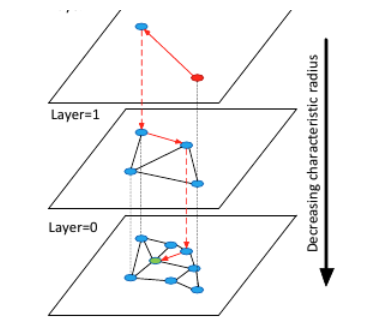
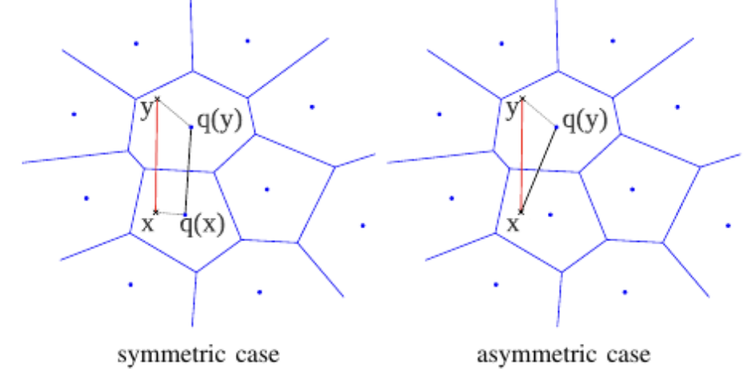

# BBDD Vectoriales - Memoria de la Sesión Práctica 2

## Índice de contenidos

0. [Introducción](#0-introducción)
1. [De los embeddings al sistema de recuperación](#1-de-los-embeddings-al-sistema-de-recuperación)
   - [1.1. El contrato que heredamos del modelo](#11-el-contrato-que-heredamos-del-modelo)
   - [1.2. El recorrido completo de una consulta](#12-el-recorrido-completo-de-una-consulta)
   - [1.3. Vectores, posiciones e identificadores](#13-vectores-posiciones-e-identificadores)
2. [Búsqueda exacta: el punto de referencia](#2-búsqueda-exacta-el-punto-de-referencia)
   - [2.1. k-NN exacto mediante fuerza bruta](#21-k-nn-exacto-mediante-fuerza-bruta)
   - [2.2. IndexFlatIP en FAISS](#22-indexflatip-en-faiss)
   - [2.3. El coste real de Flat](#23-el-coste-real-de-flat)
3. [Qué significa buscar aproximadamente](#3-qué-significa-buscar-aproximadamente)
   - [3.1. ANN no aproxima el significado](#31-ann-no-aproxima-el-significado)
   - [3.2. Recall@k del índice](#32-recallk-del-índice)
   - [3.3. Cómo construir un benchmark honesto](#33-cómo-construir-un-benchmark-honesto)
   - [3.4. La frontera de Pareto](#34-la-frontera-de-pareto)
4. [IVF: buscar primero la región del espacio](#4-ivf-buscar-primero-la-región-del-espacio)
   - [4.1. El cuantizador grueso y las listas invertidas](#41-el-cuantizador-grueso-y-las-listas-invertidas)
   - [4.2. nlist y nprobe](#42-nlist-y-nprobe)
   - [4.3. Errores de frontera, desequilibrio y deriva](#43-errores-de-frontera-desequilibrio-y-deriva)
5. [HNSW: navegar por un grafo de proximidad](#5-hnsw-navegar-por-un-grafo-de-proximidad)
   - [5.1. De small world a una jerarquía navegable](#51-de-small-world-a-una-jerarquía-navegable)
   - [5.2. M, efConstruction y efSearch](#52-m-efconstruction-y-efsearch)
   - [5.3. Memoria, construcción y mutaciones](#53-memoria-construcción-y-mutaciones)
6. [Product Quantization: comprimir para poder buscar](#6-product-quantization-comprimir-para-poder-buscar)
   - [6.1. Cuantizar un vector](#61-cuantizar-un-vector)
   - [6.2. Dividir el espacio en subespacios](#62-dividir-el-espacio-en-subespacios)
   - [6.3. Distancia asimétrica](#63-distancia-asimétrica)
   - [6.4. IVF-PQ y las dos fuentes de aproximación](#64-ivf-pq-y-las-dos-fuentes-de-aproximación)
7. [El contrato operativo de FAISS](#7-el-contrato-operativo-de-faiss)
   - [7.1. train, add y search](#71-train-add-y-search)
   - [7.2. Metadatos y filtros](#72-metadatos-y-filtros)
   - [7.3. Persistencia, versionado y carga](#73-persistencia-versionado-y-carga)
8. [Elegir el índice del marketplace](#8-elegir-el-índice-del-marketplace)
   - [8.1. Cuando Flat sigue siendo la mejor respuesta](#81-cuando-flat-sigue-siendo-la-mejor-respuesta)
   - [8.2. Una decisión condicionada por restricciones](#82-una-decisión-condicionada-por-restricciones)
9. [Referencias y bibliografía](#9-referencias-y-bibliografía)

---

## 0. Introducción

Ya disponemos de una representación vectorial para cada producto y sabemos cómo comparar dos embeddings. Eso resuelve una parte esencial del buscador, pero todavía no explica cómo encontrar los vecinos de una consulta cuando el catálogo deja de contener unos cientos de productos y empieza a crecer hacia cientos de miles o millones.

La solución más directa consiste en comparar la query con todos los vectores del catálogo, ordenar los resultados y quedarse con los primeros $k$. Este procedimiento ofrece el ranking exacto para la métrica elegida. También realiza una cantidad de trabajo proporcional al tamaño completo del catálogo en cada búsqueda. A veces ese coste es perfectamente asumible; otras veces se convierte en el cuello de botella del sistema.

En esta memoria estudiaremos qué ocurre cuando aceptamos una búsqueda **aproximada** para evitar parte de esas comparaciones. No cambiaremos el modelo de embeddings ni relajaremos la definición de relevancia comercial. Lo que aproximaremos será el procedimiento empleado para localizar los vecinos que ese espacio considera más cercanos.

El caso práctico continúa siendo el buscador de un marketplace. Trabajaremos con 50.000 productos españoles del Shopping Queries Dataset [[1]](#ref-1) y embeddings normalizados de `multilingual-e5-small`. Sobre ese mismo catálogo construiremos un índice exacto y varias alternativas de FAISS: IVF-Flat, HNSW-Flat e IVF-PQ. La pregunta no será qué algoritmo posee el nombre más sofisticado, sino qué trabajo evita, qué error introduce y bajo qué restricción merece la pena utilizarlo.

---

## 1. De los embeddings al sistema de recuperación

Un embedding no es todavía un buscador. Es una representación sobre la que podemos definir una comparación. Para convertirla en un sistema de recuperación necesitamos conservar los vectores del catálogo, localizar candidatos, traducir las posiciones internas a identificadores de negocio, recuperar sus metadatos y medir si el resultado cumple nuestras restricciones.

### 1.1. El contrato que heredamos del modelo

Los vectores del caso práctico tienen 384 dimensiones, tipo `float32` y norma L2 igual a uno. Los documentos se generaron con el prefijo `passage:` y las consultas con `query:`, siguiendo el contrato de `multilingual-e5-small` [[2]](#ref-2). Esta información no deja de importar cuando aparece el índice. Al contrario: el índice solo puede comparar correctamente representaciones pertenecientes al mismo espacio.

Como los vectores están normalizados, maximizar el producto escalar equivale a maximizar la similitud coseno:

$$
\cos(\mathbf{q},\mathbf{x})
=\frac{\mathbf{q}^{\top}\mathbf{x}}
{\lVert\mathbf{q}\rVert_2\lVert\mathbf{x}\rVert_2}
=\mathbf{q}^{\top}\mathbf{x}.
$$

Por eso utilizaremos índices configurados para **inner product**. No estamos escogiendo una métrica distinta a la empleada al evaluar el modelo; estamos aprovechando la normalización para ejecutar la misma ordenación mediante una operación especialmente eficiente. FAISS documenta esta equivalencia y exige normalizar previamente cuando se desea implementar coseno sobre índices de producto escalar [[5]](#ref-5).

El modelo, su dimensión, la plantilla de entrada, la normalización y la métrica forman un único contrato. Cargar en el índice productos calculados con otra versión del encoder o consultar con vectores sin normalizar no produce necesariamente una excepción. Puede producir algo peor: un ranking numéricamente válido cuyo significado ya no coincide con el que evaluamos.

### 1.2. El recorrido completo de una consulta

Cuando llega una búsqueda, el texto se prepara con la misma plantilla utilizada durante la evaluación del encoder. El modelo genera el vector de consulta, el índice devuelve identificadores y scores, y la aplicación recupera las fichas de producto asociadas. Sobre esos candidatos todavía pueden aplicarse filtros, reglas de disponibilidad, fusión con una señal léxica o un reranker.

Conviene distinguir la recuperación vectorial de todo lo que ocurre a su alrededor. FAISS no sabe qué es una marca, una categoría o un producto agotado. Tampoco interpreta un score como probabilidad de compra. Su responsabilidad consiste en recibir una matriz numérica y devolver los vecinos según la métrica y el algoritmo configurados [[3]](#ref-3).

Esta separación permite localizar errores. Si el producto correcto nunca llega al conjunto candidato, el problema puede estar en el modelo o en el índice. Si llega y desaparece después, habrá que inspeccionar filtros o reglas. Si aparece entre los candidatos pero queda mal ordenado tras el reranking, el fallo pertenece a otra etapa. Llamar “buscador vectorial” a toda la tubería sin distinguir sus contratos vuelve mucho más difícil explicar qué ha sucedido.

### 1.3. Vectores, posiciones e identificadores

Una matriz de embeddings posee filas numeradas desde cero. Un catálogo, en cambio, utiliza identificadores estables como un ASIN. `IndexFlatIP` asigna por defecto IDs consecutivos según el orden de inserción. El valor `17` devuelto por FAISS significa “fila interna 17”, no “producto de negocio 17”.

La aplicación debe conservar un mapeo reproducible entre ambas capas. Si reordenamos el DataFrame después de construir el índice y utilizamos la posición como si nada hubiera cambiado, recuperaremos metadatos de otro producto. El score seguirá pareciendo razonable y el fallo puede pasar desapercibido.

FAISS permite envolver ciertos índices con `IndexIDMap` para trabajar con identificadores externos, pero eso no elimina la necesidad de gobernarlos. Los IDs deben ser enteros de 64 bits, seguir siendo únicos y persistirse junto al resto del artefacto. En este proyecto mantendremos una columna `vector_id` explícita y verificaremos que coincide con el orden de las matrices.

---

## 2. Búsqueda exacta: el punto de referencia

Antes de aproximar necesitamos saber qué resultado estamos intentando conservar. El índice exacto cumplirá dos funciones. Primero, puede ser una solución productiva completamente válida si satisface la latencia y la memoria requeridas. Segundo, proporcionará el ground truth algorítmico contra el que mediremos IVF, HNSW y PQ.

### 2.1. k-NN exacto mediante fuerza bruta

Sea una consulta $\mathbf{q}$ y un catálogo de $N$ vectores $\mathbf{x}_i\in\mathbb{R}^{d}$. La búsqueda exacta por producto escalar calcula:

$$
s_i=\mathbf{q}^{\top}\mathbf{x}_i,
\qquad i=1,\ldots,N,
$$

y selecciona los $k$ valores mayores. La fase de scoring requiere aproximadamente $N\cdot d$ multiplicaciones y sumas por consulta. Si procesamos $Q$ consultas, el trabajo crece como $O(QNd)$.

“Fuerza bruta” puede sonar a una implementación torpe, pero la operación es una multiplicación matricial altamente optimizable. Los datos son contiguos, el cálculo se vectoriza y las consultas pueden agruparse en batches. En catálogos moderados, una búsqueda exacta bien implementada puede resultar más rápida y bastante más sencilla de operar que un ANN mal configurado.

La selección del top-$k$ tampoco obliga a ordenar los $N$ scores por completo. Algoritmos de selección parcial mantienen los mejores candidatos sin pagar el coste de un sort total. Por eso no debemos estimar la latencia productiva con un bucle Python que compare vectores uno a uno: estaríamos midiendo el intérprete, no el problema.

### 2.2. IndexFlatIP en FAISS

FAISS —*Facebook AI Similarity Search*— es una biblioteca para búsqueda eficiente y clustering de vectores densos, con implementaciones para CPU y GPU [[3]](#ref-3). Su arquitectura y varias de sus optimizaciones para búsqueda a gran escala se describen en la publicación del proyecto [[7]](#ref-7). `IndexFlatIP` almacena cada vector completo en `float32` y, durante la búsqueda, calcula el producto escalar contra todo el catálogo. No necesita entrenamiento ni introduce aproximación [[4]](#ref-4).

Su contrato básico cabe en tres operaciones. Creamos el índice indicando la dimensión, añadimos una matriz contigua de vectores y buscamos una matriz de consultas:

```python
index = faiss.IndexFlatIP(embedding_dimension)
index.add(product_embeddings)
scores, vector_ids = index.search(query_embeddings, neighbor_count)
```

`scores` y `vector_ids` tienen forma `(n_queries, k)`. Para inner product, los scores se ordenan de mayor a menor. Si el índice contiene menos de $k$ elementos, FAISS completa las posiciones inexistentes con el ID `-1`. Ese centinela debe tratarse de forma explícita: utilizarlo directamente como índice de NumPy o pandas seleccionaría la última fila.

Podemos verificar el resultado calculando manualmente `product_embeddings @ query_embedding` y aplicando una selección top-$k$. Esa comprobación no es redundante. Confirma que el orden de los datos, la métrica y la interpretación de los scores coinciden con el contrato esperado.

### 2.3. El coste real de Flat

El almacenamiento bruto de un índice Flat con $N$ vectores `float32` de dimensión $d$ es aproximadamente:

$$
M_{Flat}=4Nd\ \text{bytes}.
$$

Para 50.000 productos de 384 dimensiones son unos 73,2 MiB de vectores. Un millón ocuparía alrededor de 1,43 GiB. La memoria crece linealmente y la búsqueda recorre todos los elementos, pero las cifras absolutas dependen del catálogo, el hardware, el batch y la concurrencia.

También debemos separar throughput de latencia individual. Agrupar muchas consultas permite aprovechar mejor la multiplicación matricial y eleva las queries por segundo, pero una petición online quizá llegue sola. Un benchmark que solo mida batches de cientos de consultas puede describir bien un trabajo offline y mal un endpoint interactivo.

La conclusión importante es sencilla: ANN no es un requisito ritual. Si Flat cabe en memoria y cumple el SLA con margen bajo la concurrencia esperada, su exactitud, ausencia de entrenamiento y facilidad de actualización son ventajas muy serias. El índice aproximado debe justificar la complejidad que añade mediante una restricción real.

---

## 3. Qué significa buscar aproximadamente

Los algoritmos **Approximate Nearest Neighbors** evitan examinar exhaustivamente todos los vectores o sustituyen parte de su información por una representación más compacta. A cambio, pueden omitir alguno de los vecinos que el índice exacto habría devuelto.

### 3.1. ANN no aproxima el significado

Supongamos que el encoder considera que los productos $A$, $B$ y $C$ son los tres vecinos más próximos de una query. Un índice ANN podría devolver $A$, $B$ y $D$ porque no visitó la región que contenía $C$ o porque una distancia cuantizada alteró el orden. La aproximación ocurre **después** de generar los embeddings.

Esto permite separar dos clases de error. Si Flat devuelve un producto comercialmente irrelevante, el índice ha sido fiel al espacio; el problema pertenece a la representación o a la definición de similitud. Si Flat devuelve el producto correcto y ANN lo pierde, hemos observado error algorítmico del índice.

La separación también impide usar una métrica para responder dos preguntas distintas. El recall ANN compara un índice aproximado con Flat. El recall de relevancia compara los resultados con juicios humanos. Un ANN puede tener recall algorítmico 1 y mala relevancia de negocio porque reproduce perfectamente un espacio mediocre. También puede perder algún vecino exacto sin reducir nDCG si los sustitutos recuperados son igual de relevantes.

### 3.2. Recall@k del índice

Sea $E_k(q)$ el conjunto de IDs devuelto por el índice exacto para la query $q$, y $A_k(q)$ el producido por el aproximado. Definimos:

$$
\operatorname{Recall@k}_{ANN}(q)
=\frac{|E_k(q)\cap A_k(q)|}{k}.
$$

Después calculamos la media macro sobre las consultas. Si recall@10 vale `0.95`, el índice recupera de media 9,5 de los 10 IDs exactos. No significa que el 95 % de los productos devueltos sean relevantes ni que el usuario quede satisfecho en el 95 % de las búsquedas.

El valor depende de $k$. Recuperar el vecino exacto número 10 puede ser difícil cuando pedimos diez resultados y trivial si permitimos al aproximado devolver cien candidatos antes de rerankear. Por eso un benchmark debe indicar claramente si compara top-$k$ contra top-$k$ o si mide la presencia de los vecinos exactos dentro de un conjunto candidato mayor.

También conviene observar la distribución por consulta. Dos configuraciones con recall medio 0,95 pueden comportarse de manera muy distinta: una pierde medio resultado en casi todas las queries; otra es exacta en la mayoría y falla por completo en unas pocas regiones. Para un marketplace, esas colas pueden concentrarse en categorías pequeñas o consultas especialmente importantes.

### 3.3. Cómo construir un benchmark honesto

La latencia debe medirse después de un calentamiento, repetir la búsqueda varias veces y registrar al menos mediana y percentil 95. La primera ejecución puede incluir inicialización de buffers o efectos de caché que no representan el estado estable. La media, por su parte, puede quedar dominada por valores atípicos.

Todos los índices deben recibir las mismas consultas, el mismo $k$, el mismo número de threads y el mismo formato de datos. Cambiar simultáneamente algoritmo, batch y paralelismo impide atribuir la diferencia a una causa concreta. En nuestro entorno fijaremos `FAISS_NUM_THREADS=1` para que cada configuración use el mismo presupuesto de CPU dentro de una ejecución.

El benchmark debe registrar además el tiempo de construcción, el tamaño serializado del índice y el número de comparaciones cuando la implementación permita observarlo. Reducir la latencia online puede requerir horas de entrenamiento o duplicar la memoria. Mirar una sola columna escondería ese intercambio.

Las cifras no son universales. Cambian con la versión de FAISS, la CPU, las instrucciones vectoriales disponibles, la memoria, el sistema operativo, el batch, la dimensión y la distribución de los embeddings. Un resultado sin ese contexto describe una ejecución, no una propiedad absoluta del algoritmo.

### 3.4. La frontera de Pareto

En ANN no suele existir una configuración que sea simultáneamente la más rápida, exacta y compacta. Una opción domina a otra cuando ofrece al menos la misma calidad con menor latencia y memoria, o mejora la calidad sin empeorar las demás restricciones. Las configuraciones no dominadas forman una **frontera de Pareto**.

La frontera ayuda a descartar combinaciones claramente inferiores, pero no elige por nosotros. El negocio debe fijar una restricción: recall@10 mínimo, p95 máximo o presupuesto de memoria. Solo entonces podemos buscar la configuración más barata que la satisfaga.

Elegir primero el algoritmo y justificar después el parámetro invierte el proceso. La decisión defendible empieza por la carga esperada y por la pérdida aceptable. IVF, HNSW y PQ son mecanismos para moverse dentro de esa frontera, no ganadores universales.

---

## 4. IVF: buscar primero la región del espacio

La primera estrategia para evitar comparaciones consiste en dividir el espacio en regiones y visitar únicamente aquellas que parecen prometedoras. FAISS implementa esta familia mediante índices `IndexIVF*`, cuyo nombre procede de **Inverted File** [[4]](#ref-4).

### 4.1. El cuantizador grueso y las listas invertidas

IVF entrena $nlist$ centroides mediante k-means. Cada vector del catálogo se asigna al centroide más cercano y su ID se almacena en la lista invertida correspondiente. El centroide no sustituye al vector en `IndexIVFFlat`: funciona como puerta de entrada a una partición que sigue guardando las representaciones completas.

Para una consulta nueva se calculan primero sus distancias a los centroides. El índice selecciona las regiones más próximas y compara la query únicamente con los productos almacenados en esas listas. Si visita una fracción pequeña del catálogo, reduce de forma notable el número de productos escalares.

El índice necesita una muestra de entrenamiento representativa. `train` aprende la partición; `add` asigna los productos a ella. Entrenar con datos de otro idioma, dominio o versión del modelo puede producir celdas que describen mal el espacio realmente indexado.

### 4.2. nlist y nprobe

`nlist` controla cuántas regiones existen. Con pocas listas, cada una contiene muchos vectores y el filtrado es grueso. Con demasiadas, el entrenamiento y la comparación contra centroides crecen, las listas pueden quedar poco pobladas y la muestra quizá no baste para aprenderlas bien.

`nprobe` decide cuántas listas se visitan durante la consulta. Con `nprobe=1` solo se explora la región cuyo centroide resulta más cercano. Al aumentarlo se examinan más candidatos, sube el recall y también el coste. Cuando `nprobe=nlist`, IVF-Flat se acerca a una exploración exhaustiva, aunque conserva la sobrecarga de la partición.

No debe interpretarse `nprobe/nlist` como porcentaje exacto de productos comparados. Las listas no tienen el mismo tamaño y algunas regiones del espacio son mucho más densas. FAISS expone estadísticas internas como `indexIVF_stats.ndis`, que permiten observar el número real de distancias calculadas [[6]](#ref-6).

### 4.3. Errores de frontera, desequilibrio y deriva

La consulta y su vecino exacto pueden encontrarse a ambos lados de una frontera entre celdas. Si la query se asigna a una lista y el producto cae en la contigua, `nprobe=1` no lo verá aunque estén muy cerca. Explorar varias regiones reduce este error de frontera.

El segundo problema es el desequilibrio. K-means intenta minimizar distancias, no repartir exactamente el mismo número de puntos. Una lista muy grande incrementa la latencia de cualquier consulta que la visite; una colección de listas casi vacías desperdicia parte de la partición. Conviene inspeccionar sus tamaños y no limitarse a contar centroides.

Por último aparece la deriva. El catálogo cambia, entran nuevas categorías y puede actualizarse el encoder. Los nuevos vectores se asignan a centroides aprendidos sobre la distribución anterior. Cuando la partición deja de describir los datos, llega el momento de reentrenar y reconstruir el índice. Añadir productos indefinidamente no garantiza que IVF conserve el mismo recall.

---

## 5. HNSW: navegar por un grafo de proximidad

IVF decide qué regiones visitar mediante centroides. HNSW construye un grafo en el que cada vector se conecta con vecinos próximos y busca navegando desde puntos de entrada lejanos hacia zonas progresivamente más locales [[8]](#ref-8).

### 5.1. De small world a una jerarquía navegable

Los grafos *small world* combinan conexiones locales con algunos enlaces de mayor alcance. Los enlaces largos permiten atravesar rápidamente el espacio; los cortos refinan la búsqueda cerca del objetivo. HNSW organiza esta idea en capas.

Las capas superiores contienen pocos nodos y conexiones de largo alcance. La búsqueda empieza en un punto de entrada, avanza de forma voraz hacia vecinos más próximos a la query y desciende de nivel. La capa cero contiene todos los elementos y realiza el refinamiento final.

<div align="center">
   
</div>

*Figura 1. La búsqueda comienza en una capa dispersa, recorre enlaces largos y desciende hasta la capa inferior, donde las conexiones son locales. Fuente: Malkov y Yashunin [[8]](#ref-8), figura 1.*

La navegación voraz pura podría quedar atrapada en un mínimo local. HNSW conserva un conjunto de candidatos y explora varias alternativas para aumentar la probabilidad de encontrar la región correcta. La calidad depende de cuánto se permitió explorar al construir el grafo y de cuánto se explora en cada consulta.

### 5.2. M, efConstruction y efSearch

`M` controla aproximadamente el número de conexiones por nodo. Un grafo con más enlaces ofrece más rutas alternativas y suele mejorar el recall, pero consume más memoria y hace más costosa la construcción.

`efConstruction` determina la amplitud de la búsqueda utilizada al insertar cada vector y seleccionar sus vecinos. Un valor alto produce un grafo de mayor calidad a cambio de más tiempo de construcción. No mejora retroactivamente un índice ya construido: forma parte del artefacto.

`efSearch` es el principal control online. Indica cuántos candidatos mantiene la búsqueda. Aumentarlo mejora normalmente el recall y eleva la latencia. A diferencia de `M` y `efConstruction`, puede ajustarse por consulta sin reconstruir el índice, lo que permite perfiles distintos para tráfico interactivo y trabajos offline.

La relación entre los tres parámetros explica por qué un barrido exclusivo de `efSearch` no compara arquitecturas completas. Mide el compromiso de búsqueda dentro de un grafo concreto. Para seleccionar HNSW de forma rigurosa también habría que evaluar varias construcciones con diferentes `M` y `efConstruction`.

### 5.3. Memoria, construcción y mutaciones

`IndexHNSWFlat` conserva los vectores completos y añade las conexiones del grafo. Suele consumir más RAM que Flat. La aceleración se paga con estructura adicional, no con compresión. FAISS estima su coste por vector a partir de los $4d$ bytes del embedding y la memoria de los enlaces asociada a $M$ [[6]](#ref-6).

HNSW no necesita una fase global de entrenamiento como IVF, pero construirlo no es gratis. Cada inserción debe buscar vecinos y actualizar conexiones. Un `efConstruction` alto puede convertir la indexación en una tarea considerablemente más lenta que añadir vectores a Flat.

La implementación HNSW de FAISS admite inserciones secuenciales, pero no eliminación arbitraria: retirar nodos rompería la estructura del grafo [[4]](#ref-4). En catálogos con borrados frecuentes puede ser necesario mantener una máscara externa de elementos inactivos y reconstruir periódicamente, o elegir una arquitectura cuyo ciclo de vida encaje mejor con las mutaciones.

---

## 6. Product Quantization: comprimir para poder buscar

Flat, IVF-Flat y HNSW-Flat almacenan los vectores completos. Cuando la memoria se convierte en la restricción dominante, podemos aproximar también la representación mediante cuantización.

### 6.1. Cuantizar un vector

Un cuantizador aprende un conjunto finito de centroides. En lugar de guardar cada vector original, almacena el código del centroide que mejor lo representa. La reconstrucción $\widehat{\mathbf{x}}$ ocupa menos memoria, pero introduce un error:

$$
\varepsilon(\mathbf{x})
=\lVert\mathbf{x}-\widehat{\mathbf{x}}\rVert_2^2.
$$

Aprender un único codebook capaz de representar un espacio de 384 dimensiones con gran precisión requeriría una cantidad descomunal de centroides. Product Quantization evita ese crecimiento dividiendo el problema.

### 6.2. Dividir el espacio en subespacios

PQ separa el vector en $m$ subvectores de dimensión $d/m$ y entrena un cuantizador independiente para cada bloque [[9]](#ref-9):

$$
\mathbf{x}
=\left[\mathbf{x}^{(1)},\ldots,\mathbf{x}^{(m)}\right].
$$

Si cada subcuantizador utiliza $2^{nbits}$ centroides, guardamos un índice de `nbits` por bloque. Con `nbits=8`, cada subvector necesita un byte; el código completo ocupa aproximadamente $m$ bytes por producto, frente a $4d$ bytes del `float32` original.

Para embeddings de 384 dimensiones y `m=48`, cada bloque contiene ocho coordenadas y el código ocupa 48 bytes. El vector original ocupa 1.536 bytes. La compresión bruta es de 32 veces, antes de añadir IDs, centroides y estructura del índice.

La dimensión debe ser divisible por $m$. Aumentar $m$ crea más bloques pequeños, alarga el código y suele reducir el error. Aumentar `nbits` ofrece más centroides por bloque, pero agranda los codebooks y el coste de las tablas de distancia. Ambos parámetros modifican memoria, entrenamiento y precisión.

### 6.3. Distancia asimétrica

Durante la consulta no es necesario cuantizar la query. **Asymmetric Distance Computation** mantiene $\mathbf{q}$ completa y aproxima únicamente cada vector del catálogo mediante su código. Para cada subespacio se calculan las distancias entre el fragmento de la query y todos los centroides; puntuar un producto se reduce después a consultar y sumar $m$ valores precalculados.



*Figura 2. En la comparación simétrica se cuantizan query y documento. En la asimétrica, la query permanece exacta y solo se aproxima el vector almacenado, reduciendo parte de la distorsión. Fuente: Jégou, Douze y Schmid [[9]](#ref-9), figura 2.*

La distancia deja de ser exacta porque sustituimos $\mathbf{x}$ por $\widehat{\mathbf{x}}$. Dos productos con scores muy cercanos pueden invertir su orden. Aumentar el número de candidatos y rerankearlos con sus vectores completos puede recuperar parte de esa calidad, siempre que todavía conservemos o podamos leer las representaciones originales.

### 6.4. IVF-PQ y las dos fuentes de aproximación

`IndexIVFPQ` combina partición y compresión. Primero selecciona unas pocas listas mediante el cuantizador grueso de IVF. Después puntúa los elementos de esas listas utilizando códigos PQ, normalmente sobre el residual respecto al centroide.

Esto introduce dos errores distintos. Un vecino puede quedar fuera porque su lista no fue visitada; aumentar `nprobe` combate ese problema. También puede entrar en el conjunto candidato y quedar mal ordenado porque su distancia cuantizada es imprecisa; visitar más listas no elimina esa segunda distorsión.

La curva de recall permite distinguirlos. Si el recall sigue aumentando al subir `nprobe`, todavía domina la selección de celdas. Si se aplana claramente por debajo de uno, la cuantización está limitando el ranking y habrá que cambiar `m`, `nbits`, la transformación previa o añadir reranking.

---

## 7. El contrato operativo de FAISS

Entender los algoritmos no basta para operar el índice. FAISS tiene contratos concretos sobre entrenamiento, memoria, IDs, persistencia y filtrado que deben formar parte del diseño.

### 7.1. train, add y search

Los índices Flat y HNSW-Flat no requieren `train`; pueden recibir vectores mediante `add`. IVF y PQ contienen centroides aprendidos y deben entrenarse antes. FAISS expone `index.is_trained` para comprobarlo [[3]](#ref-3).

La matriz de entrenamiento debe ser `float32`, bidimensional, contigua y representativa. Entrenar con todos los datos no siempre es necesario, pero una muestra minúscula o sesgada degrada los centroides. El seed y el procedimiento de muestreo deben versionarse si queremos reproducir el artefacto.

Después de `add`, `index.ntotal` debe coincidir con el número de productos esperado. Antes de aceptar tráfico conviene buscar un conjunto de queries canarias y verificar IDs conocidos, normas, dimensión y ausencia de `NaN` o infinito.

### 7.2. Metadatos y filtros

FAISS trabaja principalmente con vectores e IDs. Los atributos de negocio viven fuera del índice. Esto obliga a decidir cómo aplicar filtros como marca, categoría, país, precio o disponibilidad.

El **post-filter** pide más vecinos de los necesarios, recupera metadatos y descarta los que no cumplen. Es sencillo, pero puede devolver menos de $k$ resultados cuando el filtro es selectivo. Aumentar mucho el conjunto candidato encarece la búsqueda y no garantiza cobertura.

Algunos índices IVF admiten selectores de IDs que evitan puntuar elementos no permitidos. Otra arquitectura mantiene particiones físicas por mercado o categoría. Las particiones reducen el universo de búsqueda, pero multiplican índices y pueden dejar shards demasiado pequeños o desequilibrados.

El recall debe medirse condicionado al filtro. Un sistema puede obtener recall global excelente y fallar en marcas minoritarias porque los candidatos permitidos nunca aparecen dentro del oversampling. La selectividad forma parte del workload, no es una propiedad secundaria del endpoint.

### 7.3. Persistencia, versionado y carga

FAISS permite serializar un índice con `write_index` y cargarlo mediante `read_index`. El archivo debe viajar acompañado por el mapeo de IDs, el modelo, la dimensión, la métrica, los parámetros de construcción, los hashes de los embeddings y las versiones de FAISS y de la aplicación.

La carga debe verificarse. Buscaremos un conjunto canario antes y después de serializar y exigiremos los mismos IDs. También comprobaremos `ntotal`, dimensión y tipo del índice. Un archivo existente no demuestra que corresponda al catálogo activo.

Las actualizaciones importantes deberían construirse en paralelo. Generamos un nuevo índice, lo evaluamos, lo cargamos como versión candidata y cambiamos el tráfico de forma atómica. Modificar en caliente el artefacto compartido complica la reversión y puede dejar consultas y catálogo en estados incompatibles.

---

## 8. Elegir el índice del marketplace

La elección final no sale de una tabla universal. Depende del tamaño, la dimensión, el hardware, el patrón de consultas, la frecuencia de actualización, la memoria disponible y la pérdida de vecinos que el producto puede aceptar.

### 8.1. Cuando Flat sigue siendo la mejor respuesta

Con 50.000 productos de 384 dimensiones, Flat ocupa una cantidad razonable de memoria y puede cumplir holgadamente una carga moderada. En ese escenario ofrece exactitud, construcción inmediata y una superficie operativa pequeña. Usar ANN solo porque el proyecto trata sobre ANN sería confundir el objetivo didáctico con una necesidad del sistema.

La decisión puede cambiar al crecer el catálogo, aumentar la concurrencia o reducir el presupuesto de RAM. Lo importante es conservar Flat como baseline y como oráculo. Incluso si producción utiliza HNSW o IVF-PQ, un índice exacto sobre una muestra o una réplica offline permite detectar degradaciones.

### 8.2. Una decisión condicionada por restricciones

IVF-Flat resulta atractivo cuando queremos conservar vectores completos, aceptamos una fase de entrenamiento y podemos reajustar `nprobe`. HNSW suele ofrecer una frontera calidad-latencia muy competitiva cuando la RAM no es el principal problema, a cambio de más memoria, construcción y restricciones de borrado. IVF-PQ aparece cuando comprimir deja de ser opcional y aceptamos una segunda fuente de error.

| Restricción dominante | Primera alternativa que conviene evaluar | Motivo |
|---|---|---|
| Exactitud obligatoria y catálogo manejable | `IndexFlatIP` | No introduce error ni necesita entrenamiento |
| Menor latencia conservando vectores completos | `IndexIVFFlat` o `IndexHNSWFlat` | Evitan examinar todo el catálogo mediante particiones o navegación |
| Memoria muy limitada | `IndexIVFPQ` | Sustituye vectores completos por códigos compactos |
| Borrados frecuentes | Flat o IVF con estrategia explícita | HNSW de FAISS no admite eliminación arbitraria |
| Filtros muy selectivos | Particiones o selectores medidos | El post-filter puede agotar candidatos |

La tabla no elige una configuración. Abre un experimento. Para el marketplace fijaremos un recall@10 mínimo, compararemos p50 y p95, registraremos memoria serializada y construcción, e inspeccionaremos las queries con peor recall. Solo una configuración que cumpla simultáneamente esas condiciones será candidata.

La idea central de la sesión puede resumirse así: **el modelo define qué significa estar cerca; Flat establece cuáles son los vecinos exactos; el índice ANN decide cuánto trabajo evita para intentar encontrarlos; y el benchmark demuestra si ese intercambio merece la pena**.

---

## 9. Referencias y bibliografía

Las referencias se numeran para poder enlazarlas desde el texto. La documentación oficial describe el contrato de FAISS; los artículos originales permiten profundizar en la motivación y en los algoritmos que hay detrás de cada familia.

| N.º | Tema | Referencia principal |
|---:|---|---|
| <a id="ref-1"></a>**[1]** | Dataset ESCI | [Shopping Queries Dataset](https://github.com/amazon-science/esci-data) y [paper original](https://arxiv.org/abs/2206.06588) |
| <a id="ref-2"></a>**[2]** | Multilingual E5 | [Model card de multilingual-e5-small](https://huggingface.co/intfloat/multilingual-e5-small) |
| <a id="ref-3"></a>**[3]** | FAISS | [Repositorio oficial](https://github.com/facebookresearch/faiss) y [Getting started](https://github.com/facebookresearch/faiss/wiki/Getting-started) |
| <a id="ref-4"></a>**[4]** | Familias de índices | [Faiss indexes](https://github.com/facebookresearch/faiss/wiki/Faiss-indexes) |
| <a id="ref-5"></a>**[5]** | Métricas | [MetricType and distances](https://github.com/facebookresearch/faiss/wiki/MetricType-and-distances) |
| <a id="ref-6"></a>**[6]** | Selección y observabilidad | [Guidelines to choose an index](https://github.com/facebookresearch/faiss/wiki/Guidelines-to-choose-an-index) e [Implementation notes](https://github.com/facebookresearch/faiss/wiki/Implementation-notes) |
| <a id="ref-7"></a>**[7]** | Arquitectura de FAISS | [Billion-scale similarity search with GPUs](https://arxiv.org/abs/1702.08734) |
| <a id="ref-8"></a>**[8]** | HNSW | [Efficient and Robust Approximate Nearest Neighbor Search Using HNSW](https://arxiv.org/abs/1603.09320) |
| <a id="ref-9"></a>**[9]** | Product Quantization | [Product Quantization for Nearest Neighbor Search](https://doi.org/10.1109/TPAMI.2010.57) y [versión abierta](https://inria.hal.science/inria-00514462) |
